

<pre>
                     __             ___             
                    /\ \      __  /'___\            
  ____     __     __\ \ \/'\ /\_\/\ \__/  __  __    
 /',__\  /'__`\ /'__`\ \ , < \/\ \ \ ,__\/\ \/\ \   
/\__, `\/\  __//\  __/\ \ \\`\\ \ \ \ \_/\ \ \_\ \  
\/\____/\ \____\ \____\\ \_\ \_\ \_\ \_\  \/`____ \ 
 \/___/  \/____/\/____/ \/_/\/_/\/_/\/_/   `/___/> \
                                              /\___/
                                              \/__/ 
</pre>

a self-hosted music player. rip what's missing.

Seekify is a music player you run yourself. Point it at your music and listen
in any browser. It can also find and download tracks you don't have yet, tag
them, and keep your library tidy.

<strong>see it on a phone</strong>

The whole thing works on a phone too. Open it in the browser, or install it as
an app for a full-screen player.

<table>
  <tr>
    <td width="50%" align="center">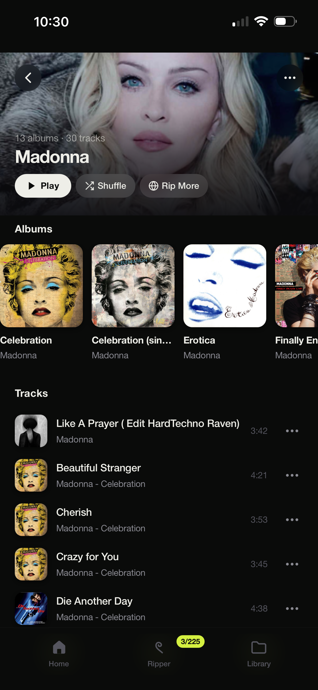</td>
    <td width="50%" align="center">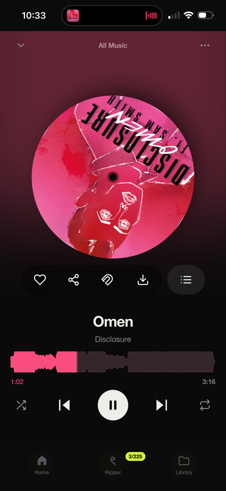</td>
  </tr>
  <tr>
    <td width="50%" align="center">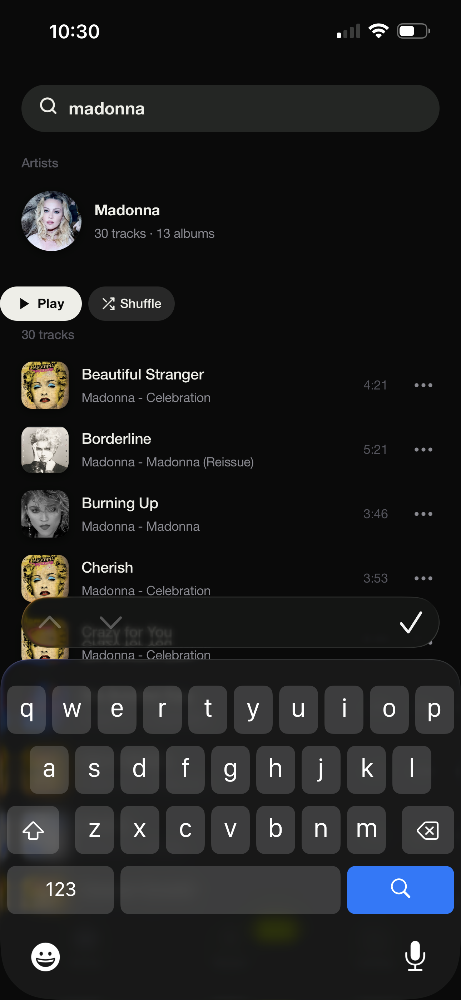</td>
    <td width="50%" align="center">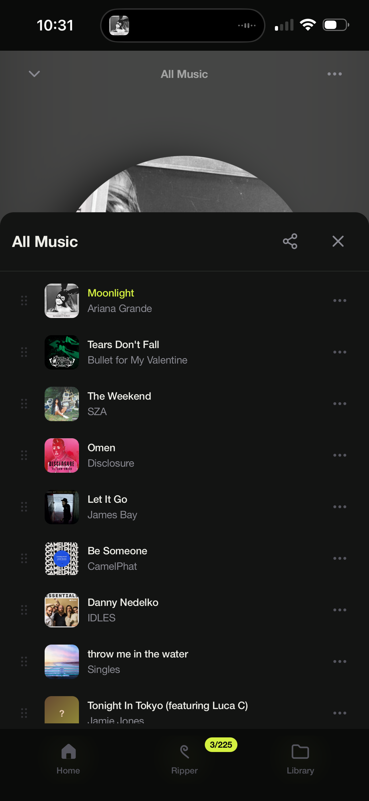</td>
  </tr>
  <tr>
    <td width="50%" align="center">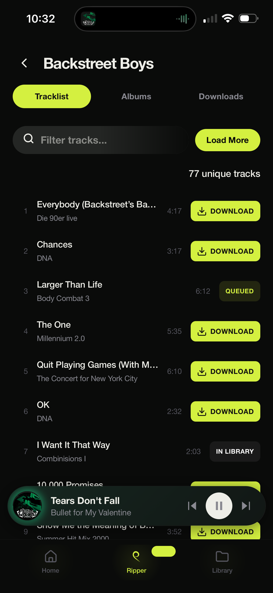</td>
    <td width="50%" align="center">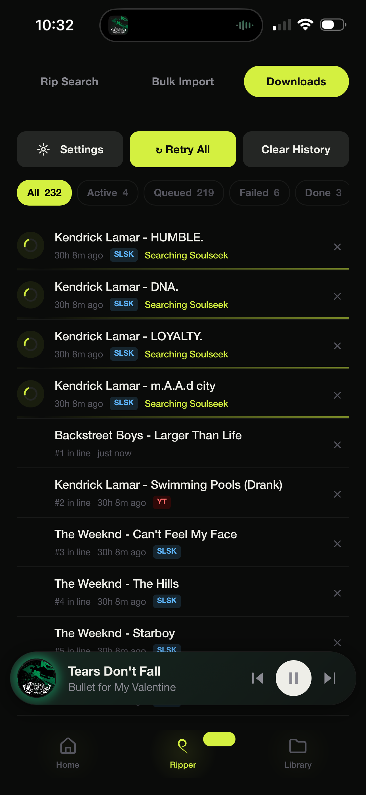</td>
  </tr>
  <tr>
    <td width="50%" align="center"></td>
    <td width="50%" align="center">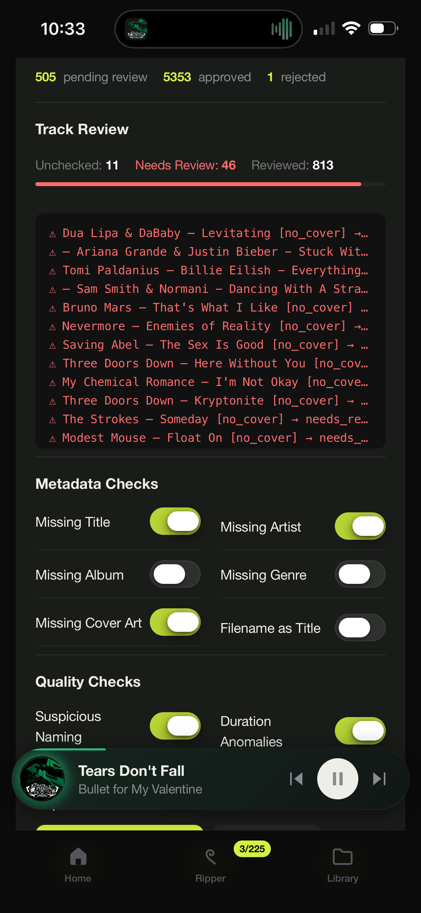</td>
  </tr>
  <tr>
    <td width="50%" align="center">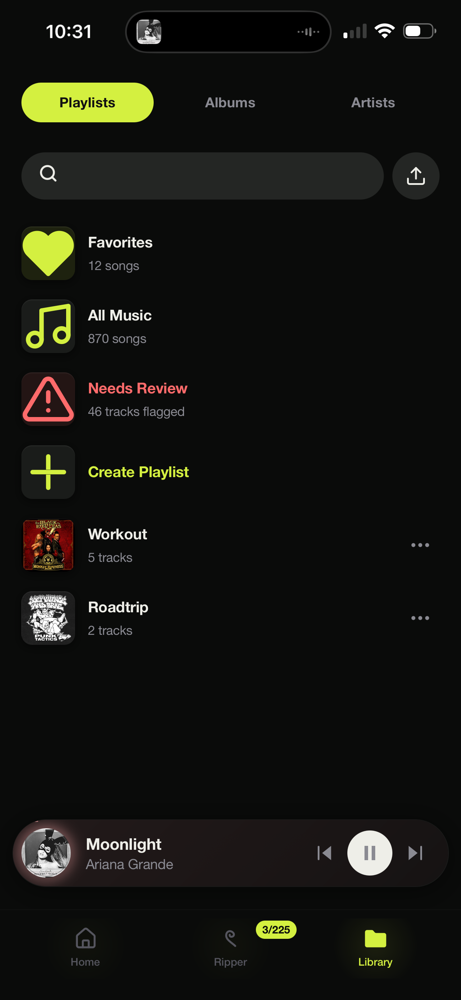</td>
    <td width="50%" align="center">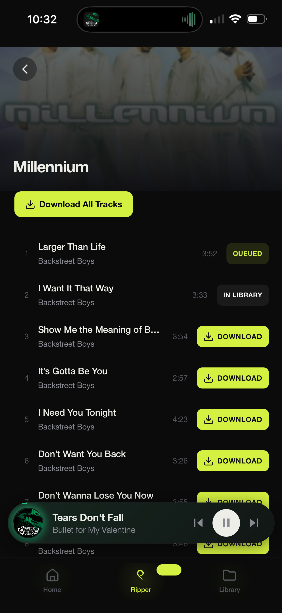</td>
  </tr>
  <tr>
    <td width="50%" align="center">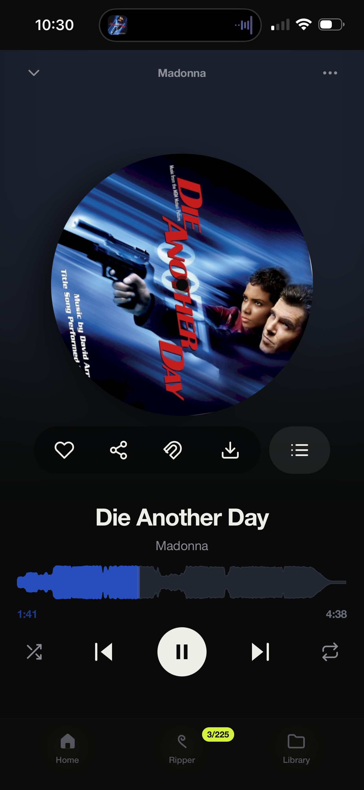</td>
    <td width="50%" align="center"></td>
  </tr>
</table>

<strong>see it on a computer</strong>

<table>
  <tr><td align="center"> home</td></tr>
  <tr><td align="center">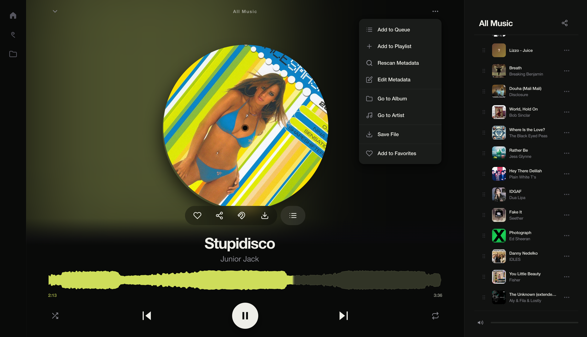 now playing</td></tr>
  <tr><td align="center">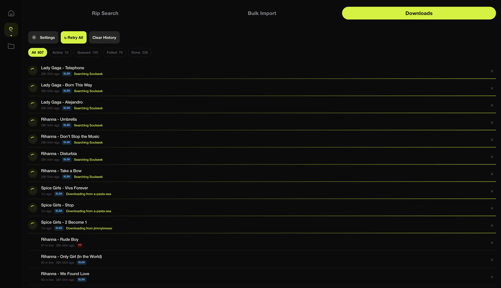 live queue</td></tr>
  <tr><td align="center">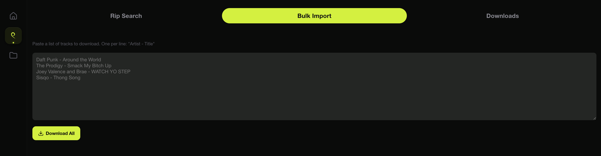 bulk import</td></tr>
  <tr><td align="center">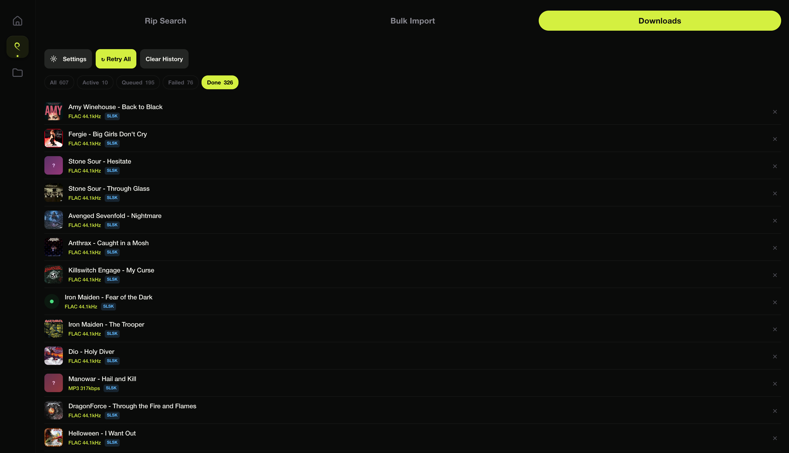 done</td></tr>
  <tr><td align="center">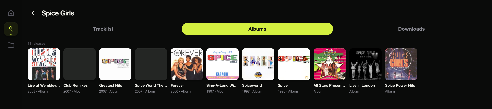 artist / albums</td></tr>
  <tr><td align="center">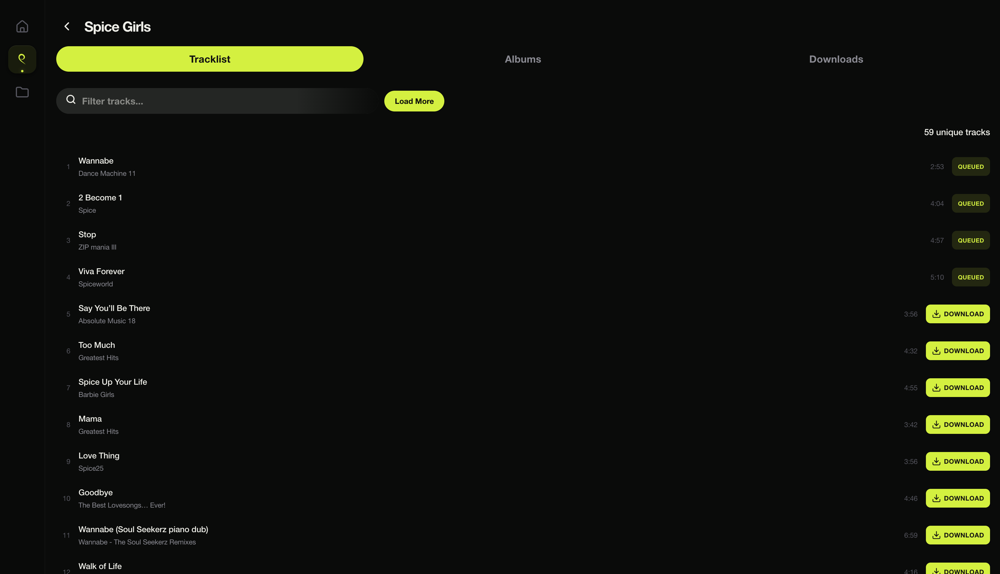 artist / tracks</td></tr>
  <tr><td align="center">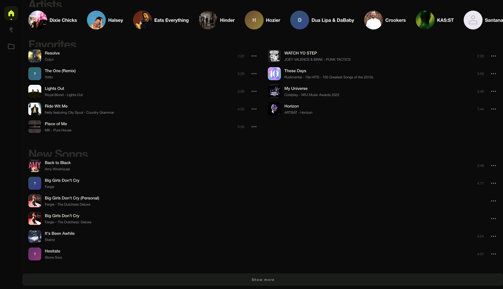 favorites + new</td></tr>
  <tr><td align="center">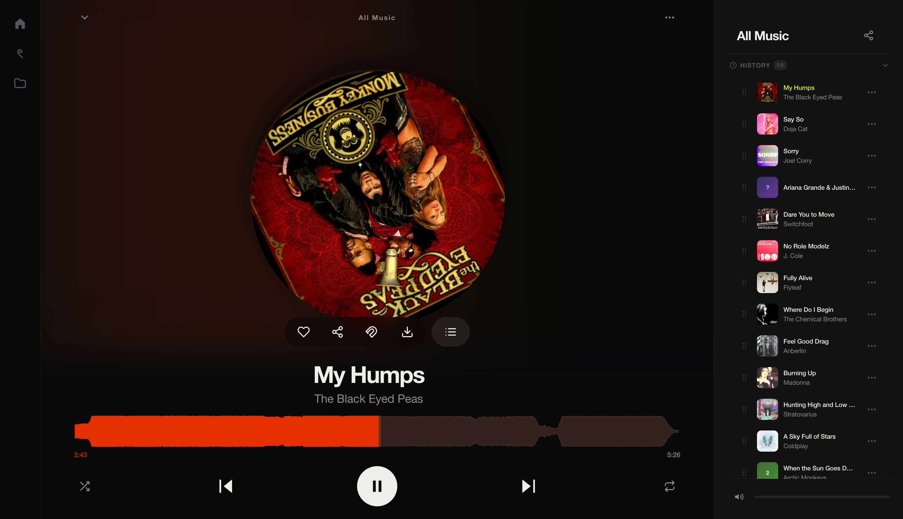 history</td></tr>
</table>

---

### █ the player
- browse albums, artists, playlists, and favorites, with a history of what you've played
- now-playing screen with a waveform, queue, shuffle, and repeat
- floating mini-player; lock-screen and media-key controls when you install it as an app
- per-track menu to queue, add to a playlist, fix the tags, jump to the album or artist, or favorite

### █ the ripper
- search for a single track or a whole album and download it
- pull from Soulseek or YouTube, and you choose which to prefer
- bulk import: paste a list of songs and download them all at once
- watch each job live, from searching to downloading to tagging to done

### █ housekeeping
- downloaded music is tagged and sorted into artist and album folders for you
- a needs-attention view flags the rough stuff: missing info, messy names, duplicates, missing artwork
- fix problems inline, fetch new artwork, or re-look-up the details
- approve a track once and it stays approved

### █ how to use it
1. put your music files in your music folder
2. open Seekify in a browser and your library shows up on its own
3. press play; search for and download anything you're missing
4. keep the needs-attention list tidy and your library stays clean

### █ runs anywhere
Seekify runs as one program and works on its own. Optional helpers add more,
and it runs fine without them: yt-dlp for YouTube, ffmpeg for converting and
waveforms, and python for Soulseek. Everything else, like download format, sources,
Soulseek login, and what the needs-attention checker looks for, you set inside
the app.

### █ scripts
The scripts folder has simple start and stop scripts: a version for Mac and
Linux (start.sh / stop.sh), one for Windows (start.bat / stop.bat), and a
double-click starter for Mac. They install anything Seekify needs, build it,
and run it, or stop it.

### █ the .env file
.env is a plain-text settings file that sits next to the app. It's a short, optional
list of preferences, one per line, written as NAME=value. Open it in any text
editor, change a value, and save. You don't need it to run; it's there for the
few things you might want to set before starting.

If you ever lose it or mess it up, here's the whole file to copy back in:

<pre>
# Copy to .env and edit. Real environment variables override this file.

# A passcode that locks the settings screen (download options, Soulseek login,
# and the like). It does not lock the player or your music; those stay open.
# No effect unless you switch ADMIN_AUTH_ENABLED on below.
ADMIN_PASSCODE=

# Switch this to true to ask for the passcode before opening settings.
# Off (the default) means settings are open, just like the rest of Seekify.
ADMIN_AUTH_ENABLED=false

# Primary music library directory.
MUSIC_DIR=./music

# Optional secondary read-only library (mounted with a "media:" prefix).
# MEDIA_MUSIC_DIR=

# HTTP listen port.
PORT=8081
</pre>

Everything else, like download format, sources, Soulseek login, and the
needs-attention checker, lives in the app's own settings screen. That screen is
the only thing a passcode guards; your music and the player stay open either way.
And if you set the same thing as a real environment variable on your system, that
takes priority.

### █ running it
Once it's running, Seekify lives at **http://localhost:8081** on the machine you
started it on. It's local access for you and anything else on that machine.

There's an example GitLab pipeline (the .gitlab-ci.yml file) that builds a
Docker image and drops it on an Unraid-style server. It's just an example. Use
it, adapt it, or ignore it.

A couple of things are on you, and a little beyond what Seekify covers:

- **reaching it from the internet**: opening it up to the outside world means
  setting up port forwarding on your router. That's between you and your network.
- **starting it automatically**: Seekify runs while you start it. Making it
  launch on boot is something you set up with your own operating system.

### █ credits
Written in Go, with a vanilla JavaScript and CSS front end, plus a little
Python and shell.

Powered by:

- [aioslsk](https://pypi.org/project/aioslsk/): Soulseek downloads
- [yt-dlp](https://github.com/yt-dlp/yt-dlp): YouTube downloads
- [musicbrainzngs](https://github.com/alastair/python-musicbrainzngs): MusicBrainz lookups
- [Cover Art Archive](https://coverartarchive.org): album art
- [lrclib](https://lrclib.net): lyrics
- [ffmpeg](https://ffmpeg.org): audio conversion and waveforms
- [dhowden/tag](https://github.com/dhowden/tag): reading audio tags
- [mutagen](https://github.com/quodlibet/mutagen): writing audio tags

---

<pre>rip it. play it. repeat.</pre>

