<div align="center">


# Seekify

**a self-hosted music player. rip what's missing.**

Seekify is a music player you run yourself. Point it at your music and listen
in any browser. It can also find and download tracks you don't have yet, tag
them, and keep your library tidy.

</div>

---

<sub>Screenshots are a snapshot, not a promise. The interface keeps moving.</sub>

<table>
  <tr>
    <td width="50%" align="center"><br><sub>home</sub></td>
    <td width="50%" align="center">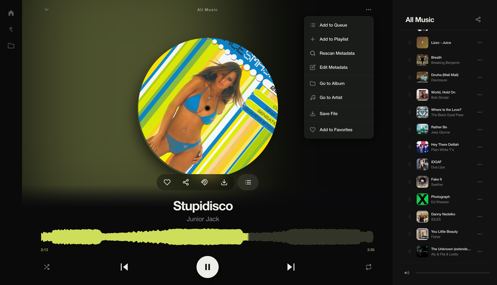<br><sub>now playing</sub></td>
  </tr>
  <tr>
    <td width="50%" align="center">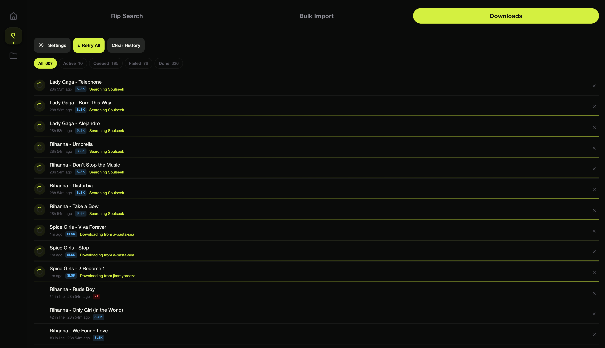<br><sub>live download queue</sub></td>
    <td width="50%" align="center">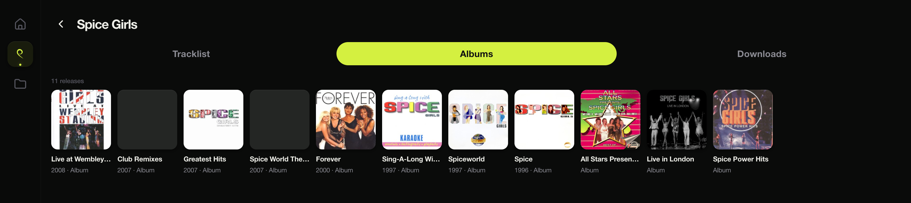<br><sub>artist / albums</sub></td>
  </tr>
</table>

**on a phone**

<table>
  <tr>
    <td width="25%" align="center">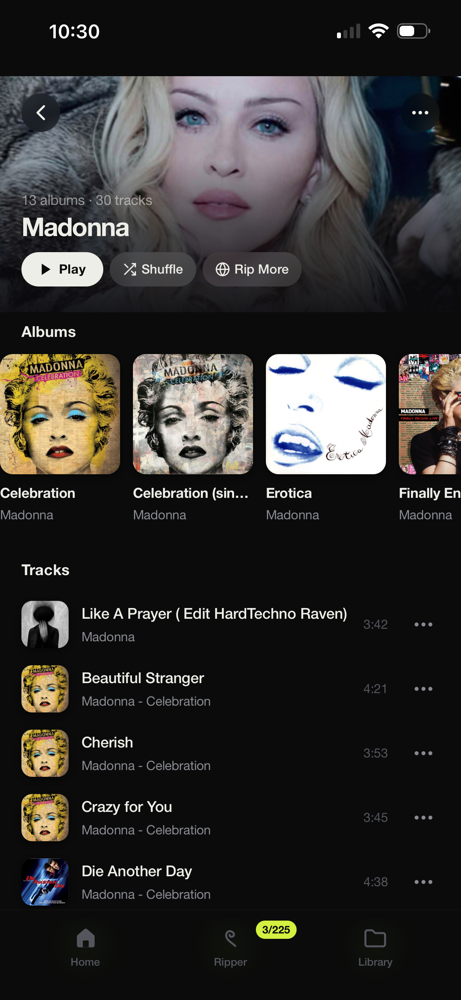</td>
    <td width="25%" align="center">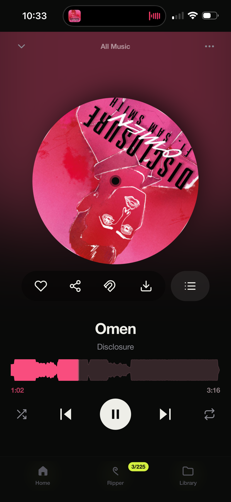</td>
    <td width="25%" align="center">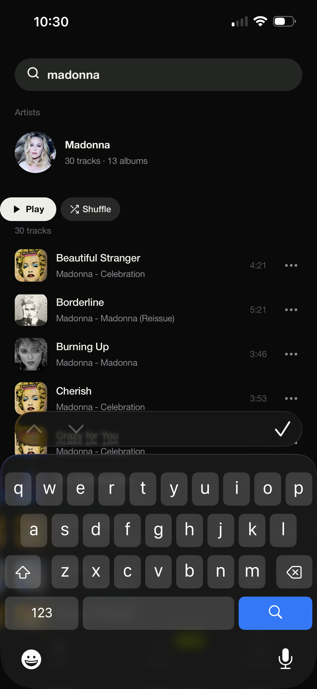</td>
    <td width="25%" align="center">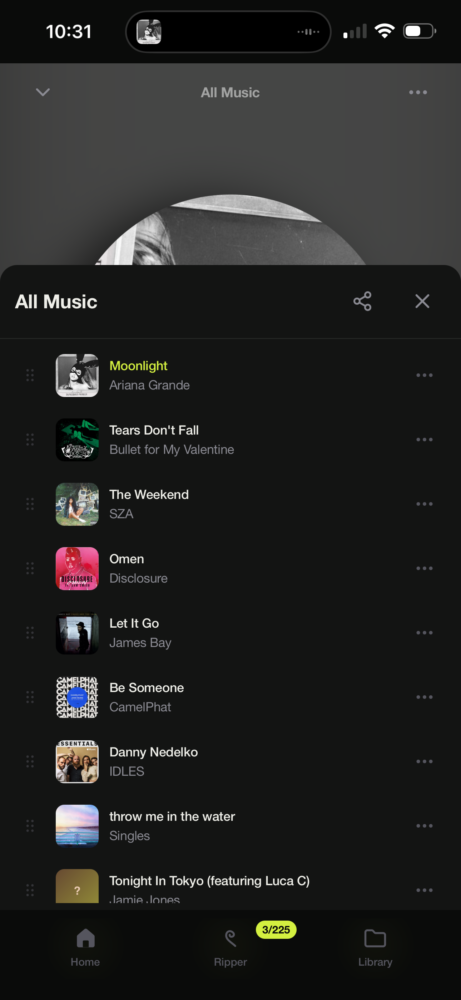</td>
  </tr>
</table>

Install it as an app on a phone for a full-screen player with lock-screen and
media-key controls.

<details>
<summary>More screenshots</summary>

<table>
  <tr>
    <td width="50%" align="center">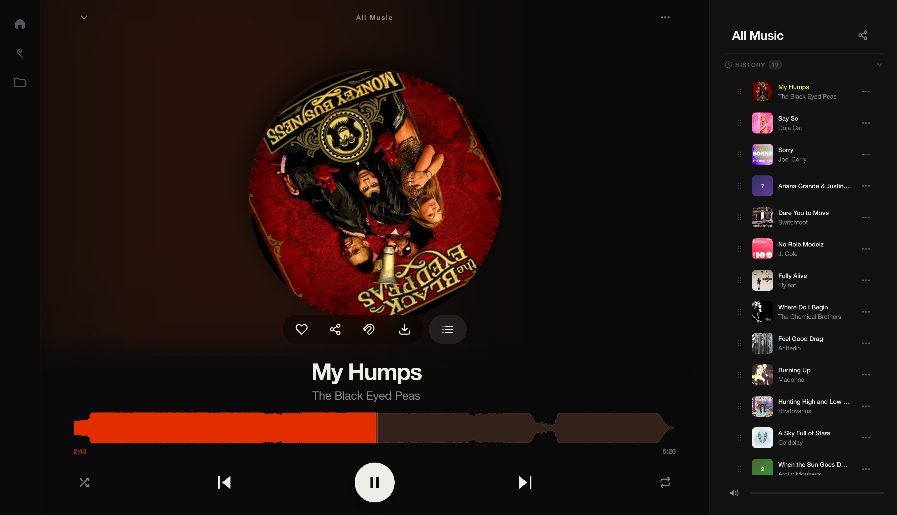<br><sub>history</sub></td>
    <td width="50%" align="center">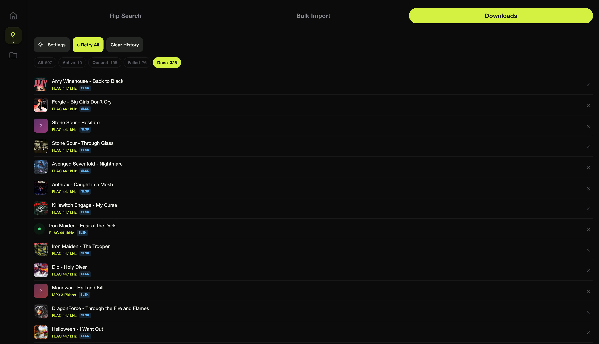<br><sub>done</sub></td>
  </tr>
  <tr>
    <td width="50%" align="center">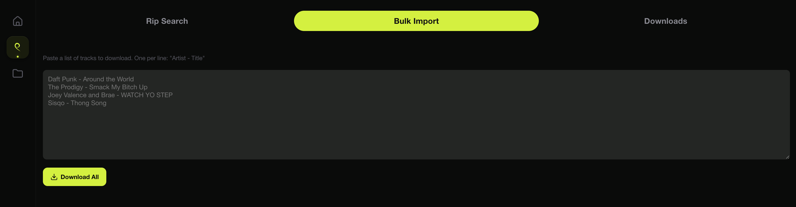<br><sub>bulk import</sub></td>
    <td width="50%" align="center">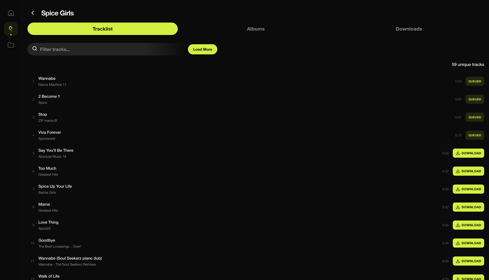<br><sub>artist / tracks</sub></td>
  </tr>
  <tr>
    <td width="50%" align="center">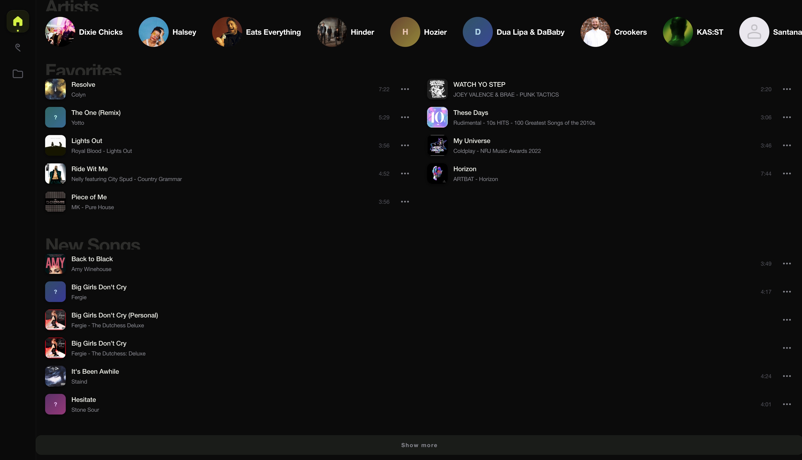<br><sub>favorites + new</sub></td>
    <td width="50%" align="center"></td>
  </tr>
</table>

<table>
  <tr>
    <td width="25%" align="center">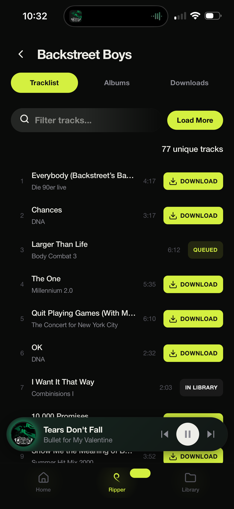</td>
    <td width="25%" align="center">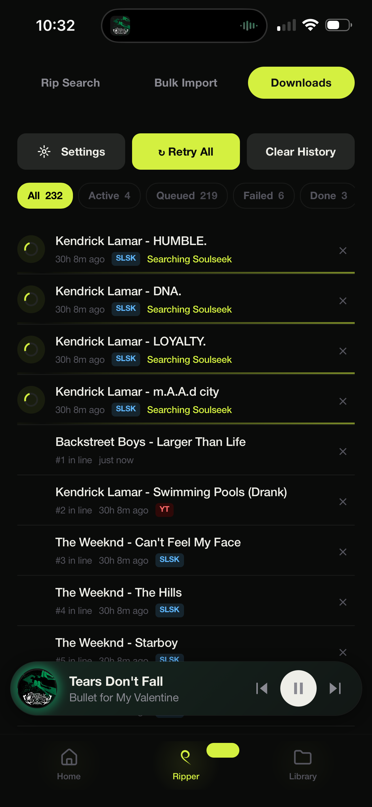</td>
    <td width="25%" align="center"></td>
    <td width="25%" align="center">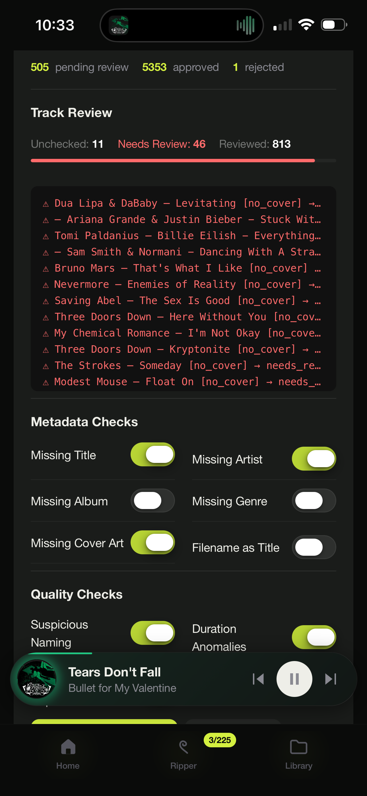</td>
  </tr>
  <tr>
    <td width="25%" align="center">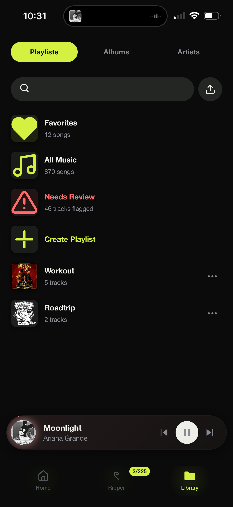</td>
    <td width="25%" align="center">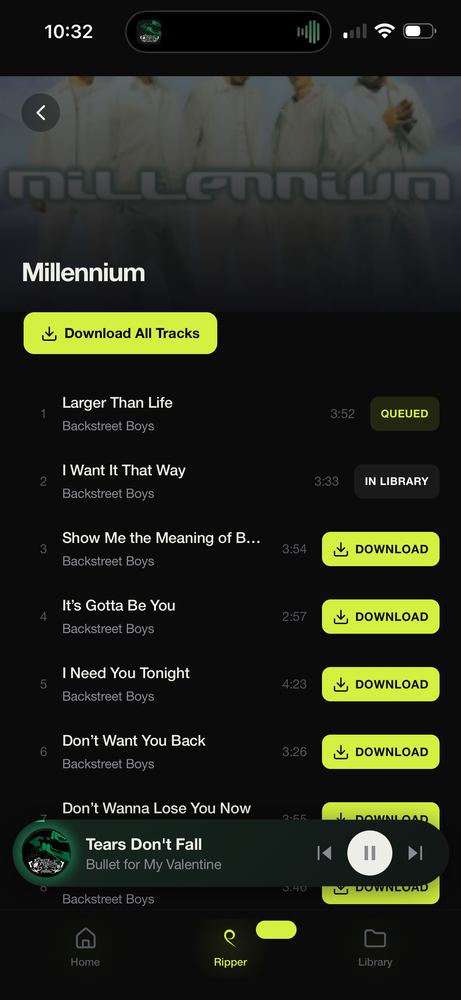</td>
    <td width="25%" align="center">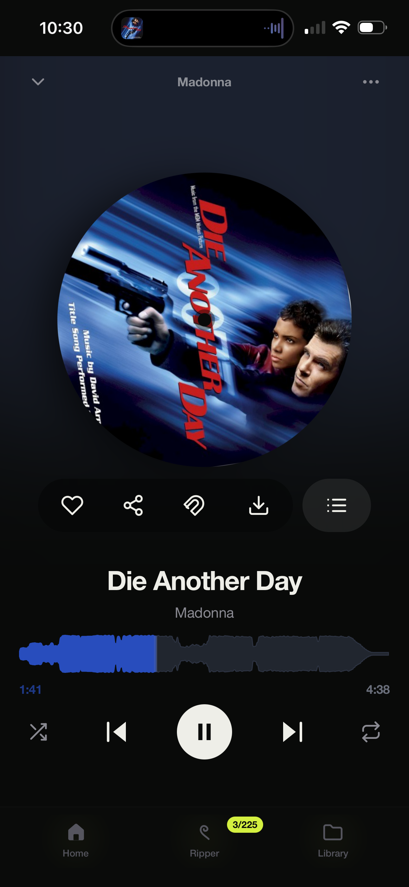</td>
    <td width="25%" align="center"></td>
  </tr>
</table>

</details>

## What It Does

- browse albums, artists, playlists and favorites, with a play history, a
  waveform seekbar, shuffle and repeat
- plays any format in any browser: if the browser can't handle it (FLAC on
  iPhone, ALAC in Chrome), the server converts it on the fly
- a full-screen audio-reactive visualizer, written in raw WebGL2 shaders and
  tinted to the current album cover
- browse an artist's whole catalogue, see which tracks you already have, and
  rip the rest with one tap; Rip More jumps there straight from now-playing
- search for a track or a whole album, paste a YouTube, SoundCloud or
  Bandcamp link, or paste a list of songs and bulk-rip them all; downloads
  come from Soulseek or YouTube, whichever you prefer, and every job shows
  its progress live
- when a download fails or arrives corrupt, the next candidate takes over,
  and live or wrong versions of a song get rejected in favor of the studio
  recording
- downloads are tagged and sorted into artist and album folders for you; a
  needs-attention view flags missing info, messy names, duplicates and bad
  artwork; fix problems inline, and a track you approve stays approved
- tags, artwork and lyrics are written into the audio files themselves, so
  anything you rip stays fully tagged if it ever leaves Seekify
- send someone a playlist link and they can play it in their browser; upload
  your own cover art when the official one is wrong
- first run sets up an admin account; each user you add gets their own
  playlists, favorites and history, and visitors can still listen
- a rolling 7-day backup of your library database
- an admin log viewer for seeing what the server has been up to

## Getting Started

The quickest start, from a clone of this repo:

```sh
./scripts/start.sh        # installs helpers if missing, builds, and runs
```

Then:

1. Seekify opens at **http://localhost:8081**. Create the admin account on
   first run.
2. Put music in the folder it's watching (`./music` next to the app, or
   whatever `MUSIC_DIR` points at). Anything you already have works: it
   reads the tags, finds cover art, and builds the library on its own.
3. Press play.
4. Missing something? Search for it and rip it. Downloads arrive tagged,
   sorted, and ready to play.

To stop it later: `./scripts/stop.sh` (Mac/Linux), `stop.bat` (Windows), or
just close it. Windows users can double-click `start.bat`; the `scripts/`
folder also has a Mac double-click starter.

Once running, Seekify runs as one program and works on its own; yt-dlp for
YouTube, ffmpeg for converting and waveforms, and python for Soulseek are
optional helpers, and it runs fine without them. Everything else (download
format, sources, Soulseek login, what the needs-attention checker looks for)
you set inside the app. There's also an example GitLab pipeline that builds a
Docker image for an Unraid-style server. Reaching it from the internet and
starting it on boot are yours to set up.

> **Soulseek account**: you need a Soulseek account before you can use the
> Soulseek download source. Seekify can register one for you in Settings, or
> you can log in with an account you already have.

<details>
<summary>The .env file</summary>

`.env` is an optional plain-text settings file (`NAME=value`, one per line)
that sits next to the app. Real environment variables override it.

```
ADMIN_PASSCODE=          # locks the settings screen only (with ADMIN_AUTH_ENABLED=true)
ADMIN_AUTH_ENABLED=false
MUSIC_DIR=./music        # primary music library
# MEDIA_MUSIC_DIR=       # optional secondary read-only library
PORT=8081
```

The passcode guards the settings screen only, never the player or your music.

</details>

## Changelog

Seekify moves fast; what's in `main` is the app. What changed lives in
[CHANGELOG.md](CHANGELOG.md).

## Credits

Written in Go, with a vanilla JavaScript and CSS front end, plus a little
Python and shell. It's powered by:

- [aioslsk](https://pypi.org/project/aioslsk/): Soulseek downloads
- [yt-dlp](https://github.com/yt-dlp/yt-dlp): YouTube downloads
- [musicbrainzngs](https://github.com/alastair/python-musicbrainzngs): MusicBrainz lookups
- [Cover Art Archive](https://coverartarchive.org): album art
- [lrclib](https://lrclib.net): lyrics
- [ffmpeg](https://ffmpeg.org): audio conversion and waveforms
- [dhowden/tag](https://github.com/dhowden/tag): reading audio tags
- [mutagen](https://github.com/quodlibet/mutagen): writing audio tags

---

<div align="center"><sub>rip it. play it. repeat.</sub></div>
