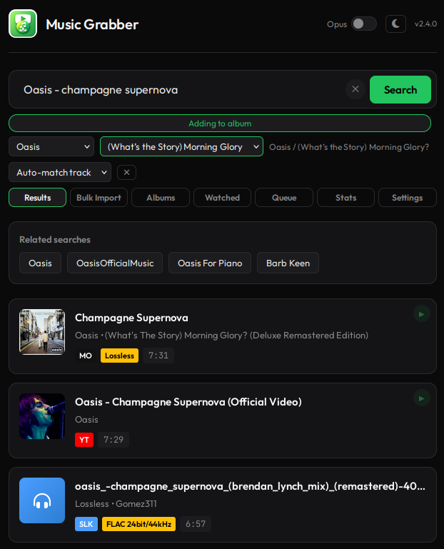
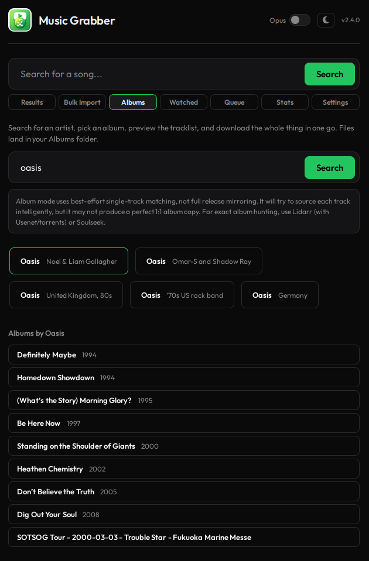
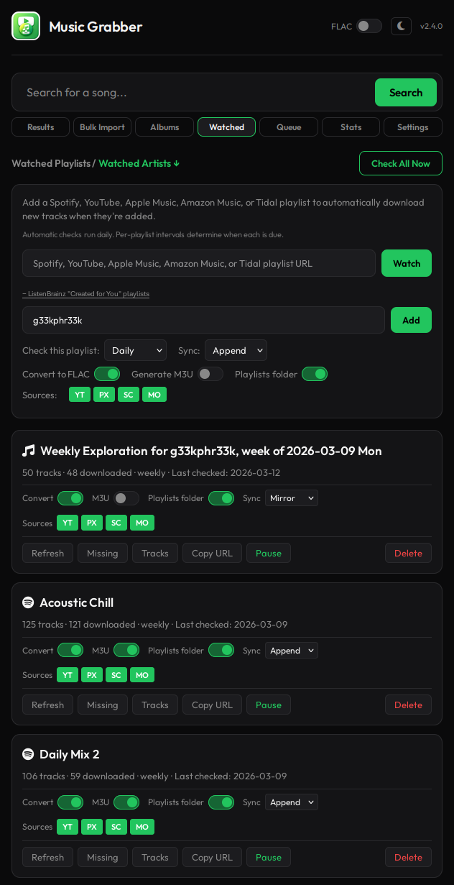
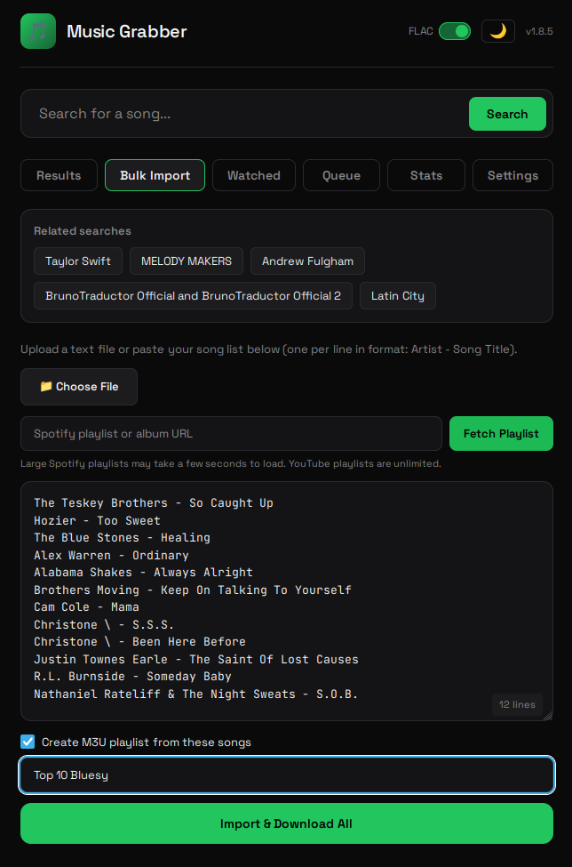
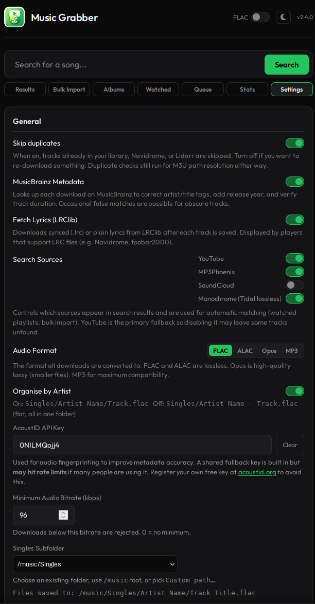
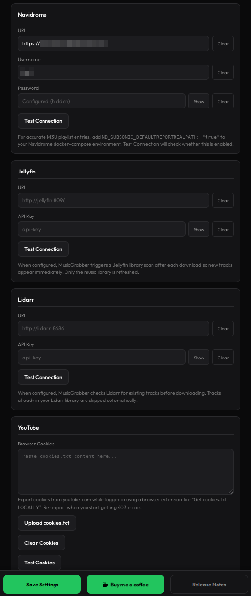
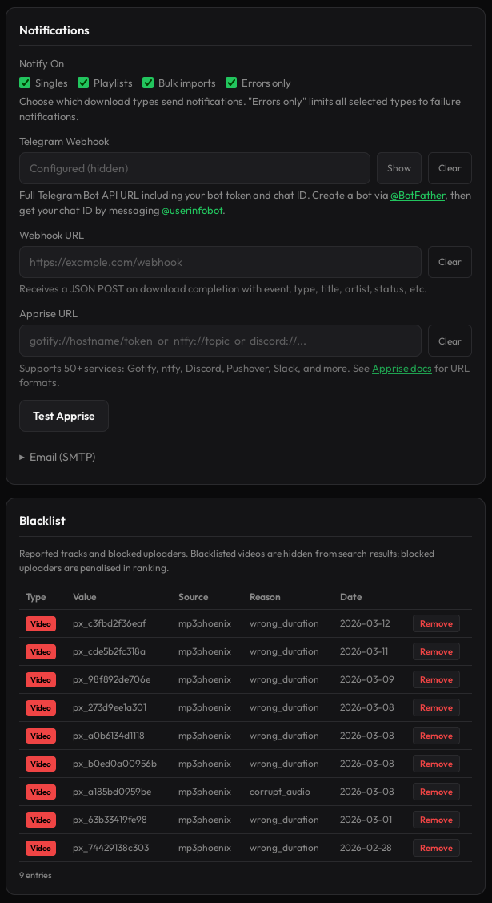

# Music Grabber
**v2.9.1**

A self-hosted music acquisition service. Search YouTube, SoundCloud, MP3Phoenix, zvu4no, FreeMp3Cloud, Monochrome/Qobuz, and optional Soulseek, tap a result and it downloads the best quality audio straight into your music library. You'll have a choice to convert to a common format, or store as is.

If you find it useful, consider buying me a coffee: https://ko-fi.com/geekphreek

## Why?

Lidarr's great for albums, but grabbing a single track you heard on the radio shouldn't require navigating menus or pulling an artist's entire discography. This is for the "I want one song, not a commitment" use case.

## What this project is not

MusicGrabber is intentionally narrow. It is **not**:

- **A full music manager** (not Lidarr, not a replacement for Navidrome/Jellyfin)
- **An album-discography automation tool** (Watched Artists monitors for new singles only; it does not grab back-catalogues but can pull individual albums)
- **A streaming server/player** (it acquires files; it does not serve or stream your library)
- **A DJ/pro-audio workflow tool** (no Atmos/spatial-audio specialist pipeline)
- **A custom library templating engine** (no advanced token-based naming/structure rules)

## Features

- **Multi-source search:** YouTube, SoundCloud, MP3Phoenix, zvu4no, Monochrome/Qobuz, and optional Soulseek searched in parallel; quality-ranked results with source badges and score explanations
- **Monochrome/Qobuz source:** searches the Tidal catalogue via hifi-api metadata, then resolves matching Qobuz FLAC streams by ISRC. It can serve proper lossless when the proxy gods are smiling. Enabled by default and configurable in Search Sources
- **Watched playlists:** monitor Spotify, YouTube (including Mixes), Amazon Music, Apple Music, SoundCloud, Tidal, Beatport, Monochrome, and ListenBrainz playlists; auto-downloads new tracks and grabs the best match available. Per-playlist sync mode: Append (M3U grows as tracks arrive) or Mirror (M3U stays in sync with the upstream; removed tracks drop out). Each card shows live refresh state and stage. "Missing" button shows tracks that never made it; Retry and Search buttons to fix them. M3U updates immediately as each track finishes
- **Watched Artists:** follow an artist on MusicBrainz and new singles are downloaded automatically as they appear. Search by name, pick from up to five candidates, set a from-date (defaults to today so your back-catalogue stays put). Singles only: remixes, live cuts, soundtracks, and compilations are filtered out at the MusicBrainz level. Tracks already on disk are recognised immediately. Per-artist check interval, convert-to-FLAC toggle, pause/resume, missing and track list panels
- **Playlist routing:** pick any watched playlist or existing `.m3u` file from the selector below the search bar; downloads land there instead of Singles
- **Album mode:** browse MusicBrainz artists, pick a release, download the full album into `Albums/Artist/Album/`, tag tracks with album context, write cover files, and optionally generate an album-local M3U. Search results can also jump straight to the matching album when MusicBrainz can identify it
- **Auto-album routing for singles:** optional setting to file single-track downloads into artist/album folders when MusicBrainz resolves an album, either under Singles or the Albums directory
- **Bulk import:** paste or upload a text file of "Artist - Title" lines; searches enabled sources in parallel and grabs the best result for each. It can also create a playlist and route files into the Playlists directory or a custom watched-playlist folder
- **Similar artist discovery:** hover any result and click Similar to explore related artists via MusicBrainz and ListenBrainz Labs. Download the lot in one go with "Download All", optionally saved as a playlist
- **Apprise notifications:** one URL covers Gotify, ntfy, Discord, Pushover, Slack, and about 50 others. Also supports Telegram webhook and SMTP email
- **Navidrome pre-download duplicate check:** queries the Subsonic API before downloading; if the track is already in your library, the existing path is used for playlist routing without re-downloading
- **Best quality audio:** output format is configurable (FLAC, ALAC/AAC-in-M4A, Opus, or MP3), with quality settings for lossy formats
- **Enhanced metadata:** AcoustID audio fingerprinting with MusicBrainz lookups, falling back to source tags. For "Artist - Title" queries, MusicBrainz expected duration is used as a scoring signal at search time, so a 1:41 DJ edit won't outrank the 3:31 original
- **Synced lyrics:** automatic lyrics fetching from LRClib, saved as `.lrc` files
- **Auto-organise:** `Singles/Artist/Title.flac` (or flat `Singles/Artist - Title.flac` with "Organise by Artist" off). Optional track-number filenames produce `Singles/Artist/1 - Title.flac` when metadata includes a track number. Album mode uses `Albums/Artist/Album/Track.flac`
- **Duplicate detection:** local filesystem check plus optional Navidrome Subsonic API check
- **Trash bin:** deleted files move to `/data/.trash/` instead of being permanently removed; restore with one click to skip re-downloading. Files that fail mismatch or duration checks also land in the trash so you can listen before they vanish
- **In-queue playback:** play button on completed queue cards and trashed files for instant preview without leaving the tab
- **Job queue:** track progress, retry failures, re-download or delete files, see metadata provenance
- **Statistics dashboard:** download counts, success rate, daily chart, top artists, search analytics
- **Release notes modal:** shows once after each update; also accessible from the Settings tab
- **Preview:** hover a result for 2 seconds on desktop, or tap Preview on mobile
- **Dark/light theme:** toggle in the header; preference saved per browser
- **Mobile-friendly UI:** designed for quick searches from your phone
- **Settings tab:** configure all integrations via UI; no docker-compose editing required
- **Multi-user support:** create user accounts with role-based access. Admins manage global settings; standard users get their own queue, watched playlists/artists, notifications, and credentials. Peon users get the stripped-back tabs and inherit global conversion/source settings, for when you want "download this song", not "reconfigure the mothership". Single-user installs work exactly as before with no configuration changes
- **Optional API authentication:** protect your instance with an API key
- **YouTube cookie support:** upload browser cookies in Settings to bypass bot detection
- **Spotify cookie support:** upload cookies from `open.spotify.com` to access private playlists, saved albums, and personal library playlists
- **Minimum bitrate enforcement:** optionally reject downloads below a configurable threshold
- **PUID/PGID support:** run as a specific user for correct file ownership on NAS/SMB shares
- **Optional Navidrome/Jellyfin/Lidarr integration:** auto-triggers library rescan after downloads
- **Soulseek integration:** optional slskd support for P2P search and downloads
- **Report/blacklist:** flag bad results from the queue; blacklisted videos and uploaders are suppressed from future searches

## Why FLAC?

For YouTube, SoundCloud, MP3Phoenix, zvu4no, and FreeMp3Cloud, FLAC conversion is primarily for standardisation and consistent tagging. It does not improve audio quality beyond the source; it only preserves what is already there. Monochrome and Soulseek may already provide proper FLAC, in which case MusicGrabber keeps the good stuff and tags it properly. If you prefer to keep the original format where possible, disable conversion and files will be saved as-is.

## Screenshots

| Search & Results | Albums | Queue |
|:---:|:---:|:---:|
|  |  |  |

| Watched Playlists | Bulk Import | Settings |
|:---:|:---:|:---:|
|  |  |  |

| Integrations & Cookies | Notifications | Dark & Light Theme |
|:---:|:---:|:---:|
|  |  |  |

## Quick Start

### Option A: Using Docker Hub (Recommended)

1. **Create a docker-compose.yml**
   ```yaml
   services:
     music-grabber:
       image: g33kphr33k/musicgrabber:latest
       container_name: music-grabber
       restart: unless-stopped
       # Required for Spotify playlists over 100 tracks (headless browser)
       shm_size: '2gb'
       ports:
         - "38274:8080"
       volumes:
         - /path/to/your/music:/music
         - ./data:/data
       environment:
         - MUSIC_DIR=/music
         - DB_PATH=/data/music_grabber.db
         # Optional: serve behind a reverse-proxy subpath (proxy must strip the prefix)
         # - ROOT_PATH=/musicgrabber
         - ENABLE_MUSICBRAINZ=true
         - DEFAULT_CONVERT_TO_FLAC=true
         # Optional: Run as specific user (like *arr stack) for correct file permissions
         # - PUID=1000
         # - PGID=1000
         # Optional: Custom bind address/port (useful for IPv6 or non-standard setups)
         # - LISTEN_ADDR=0.0.0.0
         # - LISTEN_PORT=8080
         # Optional: Navidrome auto-rescan
         # - NAVIDROME_URL=http://navidrome:4533
         # - NAVIDROME_USER=admin
         # - NAVIDROME_PASS=yourpassword
         # Optional: Jellyfin auto-rescan
         # - JELLYFIN_URL=http://jellyfin:8096
         # - JELLYFIN_API_KEY=your-jellyfin-api-key
         # Optional: Notifications
         # - NOTIFY_ON=playlists,bulk,errors
         # - TELEGRAM_WEBHOOK_URL=https://api.telegram.org/bot{token}/sendMessage?chat_id={chat_id}
         # - WEBHOOK_URL=https://your-webhook-endpoint.com/hook
         # - SMTP_HOST=smtp.example.com
         # - SMTP_PORT=587
         # - SMTP_USER=user@example.com
         # - SMTP_PASS=password
         # - SMTP_TO=you@example.com
   ```

2. **Run**
   ```bash
   docker compose up -d
   ```

3. **Access the UI** at `http://your-server:38274`

### Option B: Unraid (Community Applications)

If you're running Unraid, the easiest way is via Community Applications. Search for **MusicGrabber** and install directly from Docker Hub.

For manual setup, or if you want a reference for the XML config, here's a working Unraid template:

```xml
<Config Name="Appdata" Target="/data" Default="" Mode="rw" Description="" Type="Path" Display="always" Required="false" Mask="false">/mnt/user/appdata/musicgrabber/</Config>
<Config Name="Music" Target="/music" Default="" Mode="rw" Description="" Type="Path" Display="always" Required="false" Mask="false">/mnt/user/media/music/</Config>
<Config Name="MUSIC_DIR" Target="MUSIC_DIR" Default="" Mode="" Description="" Type="Variable" Display="always" Required="false" Mask="false">/music</Config>
<Config Name="DB_PATH" Target="DB_PATH" Default="" Mode="" Description="" Type="Variable" Display="always" Required="false" Mask="false">/data/music_grabber.db</Config>
<Config Name="ENABLE_MUSICBRAINZ" Target="ENABLE_MUSICBRAINZ" Default="" Mode="" Description="" Type="Variable" Display="always" Required="false" Mask="false">true</Config>
<Config Name="DEFAULT_CONVERT_TO_FLAC" Target="DEFAULT_CONVERT_TO_FLAC" Default="" Mode="" Description="" Type="Variable" Display="always" Required="false" Mask="false">false</Config>
<Config Name="PUID" Target="PUID" Default="" Mode="" Description="" Type="Variable" Display="always" Required="false" Mask="false">99</Config>
<Config Name="PGID" Target="PGID" Default="" Mode="" Description="" Type="Variable" Display="always" Required="false" Mask="false">100</Config>
```

PUID `99` and PGID `100` are Unraid's standard `nobody`/`users`, these give the container correct write access to your shares. Adjust if your setup differs.

### Option C: Build from Source

1. **Clone and configure**
   ```bash
   git clone https://gitlab.com/g33kphr33k/musicgrabber.git
   cd musicgrabber
   ```

2. **Edit docker-compose.yml**

   Update the music volume path and optionally add Navidrome credentials:
   ```yaml
   volumes:
     - /path/to/your/music:/music  # <-- your music directory
     - ./data:/data                # <-- keep the job database
   ```
   ```yaml
   environment:
     - NAVIDROME_URL=http://navidrome:4533
     - NAVIDROME_USER=admin
     - NAVIDROME_PASS=yourpassword
   ```

3. **Build and run**
   ```bash
   docker compose up -d --build
   ```

4. **Access the UI**

   Open `http://your-server:38274` on your phone or browser.

### Option D: Windows 10+ (One-Click Setup)

If you're running Windows and don't want to touch the command line, the `windows/` folder has batch scripts that handle everything for you.

**Requirements:** Windows 10 or later. Docker Desktop will be installed automatically if it isn't already.

1. **Download** the `windows/` folder from the repository (or clone the whole repo)
2. **Right-click `setup.bat`** and select **Run as administrator**

The setup script will:
- Check for Docker Desktop and download/install it if missing (requires a reboot; setup resumes automatically on next login)
- Wait for the Docker engine to finish starting
- Ask where you want your music saved (defaults to `%USERPROFILE%\Music\MusicGrabber`)
- Create a `docker-compose.yml` in `%APPDATA%\MusicGrabber`
- Pull the latest MusicGrabber image
- Optionally start MusicGrabber and open your browser to `http://localhost:38274`

**After setup:**

| Script | What it does |
|--------|-------------|
| `run.bat` | Starts Docker Desktop (if not running) and launches MusicGrabber |
| `stop.bat` | Stops the MusicGrabber container |

Both scripts are copied to `%APPDATA%\MusicGrabber` during setup. You can also put `run.bat` on your Desktop for easy access.

**Configuration:** music is saved to the folder you chose during setup. The database and config live in `%APPDATA%\MusicGrabber`. To change settings after install, edit `%APPDATA%\MusicGrabber\docker-compose.yml` or use the Settings tab in the web UI.

## Configuration

### Settings Tab (Recommended)

The easiest way to configure MusicGrabber is via the **Settings tab** in the UI. You can configure:

- **General**: MusicBrainz metadata, lyrics fetching, default FLAC conversion, minimum audio bitrate, artist subfolder organisation
- **Audio format**: FLAC, ALAC/AAC-in-M4A, Opus, or MP3, including MP3/Opus/ALAC quality presets
- **Library layout**: Singles, Playlists, and Albums subfolders, track-number filenames, auto-album routing, singles-only mode, and file permissions
- **Search sources**: enable/disable YouTube, SoundCloud, MP3Phoenix, zvu4no, Soulseek, and Monochrome
- **Monochrome**: hifi-api URL and Qobuz proxy URL
- **Soulseek (slskd)**: enable toggle, URL, credentials, downloads path
- **Navidrome**: URL and credentials for library refresh
- **Jellyfin**: URL and API key for library refresh
- **Lidarr**: URL and API key for library refresh
- **Notifications**: Apprise URL, Telegram webhook, generic webhook URL, and SMTP settings
- **YouTube**: Upload browser cookies for authenticated downloads
- **Spotify**: Upload browser cookies to access private playlists
- **Blacklist**: View and manage reported tracks and blocked uploaders
- **Security**: API key for authentication
- **Users** (admin only): create and manage user accounts, reset passwords

Settings are stored in the database and persist across container restarts.

**Environment variable overrides:** If you set a value via environment variable, it takes precedence over the database value and appears as "locked" in the UI.

### Environment Variables

| Variable | Default | Description |
|----------|---------|-------------|
| `PUID` | `0` | User ID for file ownership (like *arr stack) |
| `PGID` | `0` | Group ID for file ownership (like *arr stack) |
| `LISTEN_ADDR` | `0.0.0.0` | Bind address for the web service (set `::` for IPv6 environments) |
| `LISTEN_PORT` | `8080` | Bind port for the web service inside the container |
| `MUSIC_DIR` | `/music` | Music library root inside container |
| `DB_PATH` | `/data/music_grabber.db` | SQLite database path |
| `ROOT_PATH` | *(empty)* | URL prefix when serving behind a reverse proxy subpath, e.g. `/musicgrabber`. Your proxy should strip this prefix before forwarding to MusicGrabber |
| `ENABLE_MUSICBRAINZ` | `true` | Enable MusicBrainz metadata lookups |
| `ENABLE_LYRICS` | `true` | Enable automatic lyrics fetching from LRClib |
| `ACOUSTID_API_KEY` | *(shared built-in)* | AcoustID API key for audio fingerprinting. A shared key is built in but **may hit rate limits**. Register a free key at [acoustid.org](https://acoustid.org/login) and set it here (or via Settings tab) to avoid sharing quota |
| `DEFAULT_CONVERT_TO_FLAC` | `true` | Convert downloads to FLAC by default (can be toggled per-download in UI) |
| `AUDIO_FORMAT` | `flac` | Output format when conversion is enabled: `flac`, `alac`, `opus`, or `mp3` |
| `MP3_BITRATE` | `v2` | MP3 quality preset: `v2`, `v0`, `320k`, `256k`, `192k`, or `128k` |
| `OPUS_BITRATE` | `320k` | Opus bitrate: `320k`, `256k`, `192k`, `128k`, or `96k` |
| `ALAC_BITRATE` | `lossless` | ALAC/M4A quality: `lossless` for true ALAC, or `320k`, `256k`, `192k`, `128k` for AAC-in-M4A |
| `MIN_AUDIO_BITRATE` | `0` | Minimum audio bitrate in kbps. Downloads below this are rejected. 0 = disabled. Lossless (FLAC) always passes |
| `SINGLES_SUBDIR` | `Singles` | Subfolder under `MUSIC_DIR` for normal single-track downloads. Use `.` for the music root |
| `PLAYLISTS_SUBDIR` | *(empty)* | Optional subfolder under `MUSIC_DIR` for playlist-routed downloads. Empty means playlist files use the Singles layout |
| `ALBUMS_SUBDIR` | `Albums` | Subfolder under `MUSIC_DIR` for album-mode downloads. Use `.` for the music root |
| `ORGANISE_BY_ARTIST` | `true` | Create artist subfolders under Singles. Set to `false` for a flat directory |
| `INCLUDE_TRACK_NUMBER_IN_FILENAME` | `false` | Prefix saved filenames with the resolved track number when one is available, e.g. `Singles/Artist/1 - Title.flac` |
| `AUTO_ALBUM_SINGLES` | `false` | If MusicBrainz finds album context for a single, move it into `Artist/Album/` automatically |
| `AUTO_ALBUM_SINGLES_USE_ALBUMS_DIR` | `false` | Put auto-routed singles under the Albums directory instead of under Singles |
| `SINGLES_ONLY_MODE` | `false` | Hide the Albums tab while keeping single-track auto-album routing available |
| `FILE_PERMISSIONS` | `666` | File mode applied after downloads. `777` is available for stubborn NAS/share setups |
| `SKIP_DUPES` | `true` | Skip downloads when a matching local file is already found |
| `NAVIDROME_DUPE_CHECK` | `true` | Use Navidrome/Subsonic as part of duplicate detection when Navidrome is configured |
| `WEBHOOK_URL` | - | Generic webhook URL; receives JSON POST on download completion/failure |
| `YTDLP_PLAYER_CLIENT` | *(empty)* | Override yt-dlp YouTube player client (expert-only, e.g. `android`, `web,android`) |
| `YOUTUBE_BOT_BACKOFF_MIN` | `5` | Minimum backoff in seconds before retrying after YouTube bot-detection style failures |
| `YOUTUBE_BOT_BACKOFF_MAX` | `20` | Maximum backoff in seconds before retrying after YouTube bot-detection style failures |
| `NAVIDROME_URL` | - | Navidrome server URL (e.g., `http://navidrome:4533`) |
| `NAVIDROME_USER` | - | Navidrome username for API |
| `NAVIDROME_PASS` | - | Navidrome password for API |
| `JELLYFIN_URL` | - | Jellyfin server URL (e.g., `http://jellyfin:8096`) |
| `JELLYFIN_API_KEY` | - | Jellyfin API key for library refresh |
| `LIDARR_URL` | - | Lidarr server URL |
| `LIDARR_API_KEY` | - | Lidarr API key for library refresh |
| `SOURCE_YOUTUBE_ENABLED` | `true` | Enable YouTube search results |
| `SOURCE_MP3PHOENIX_ENABLED` | `true` | Enable MP3Phoenix search results |
| `SOURCE_SOUNDCLOUD_ENABLED` | `true` | Enable SoundCloud search results |
| `SOURCE_ZVU4NO_ENABLED` | `true` | Enable zvu4no search results |
| `SOURCE_SOULSEEK_ENABLED` | `false` | Enable Soulseek/slskd search results. Credentials alone do not enable Soulseek |
| `SOURCE_MONOCHROME_ENABLED` | `true` | Enable Monochrome/Qobuz search results |
| `MONOCHROME_HIFI_API_URL` | `https://monochrome-api.samidy.com,https://api.monochrome.tf,https://eu-central.monochrome.tf` | hifi-api compatible endpoint(s) used for Tidal metadata/ISRC lookups. Comma or newline separated lists are tried in order |
| `MONOCHROME_QOBUZ_PROXY_URL` | `https://qdl-api.monochrome.tf` | Qobuz proxy used to resolve direct audio streams |
| `SLSKD_URL` | - | slskd API URL (e.g., `http://slskd:5030`) |
| `SLSKD_USER` | - | slskd username |
| `SLSKD_PASS` | - | slskd password |
| `SLSKD_DOWNLOADS_PATH` | - | Path where slskd downloads are accessible (required for Soulseek downloads) |
| `SLSKD_REQUIRE_FREE_SLOT` | `true` | Only show Soulseek results from users with free upload slots |
| `SLSKD_MAX_RETRIES` | `5` | Max retry attempts for failed Soulseek downloads |
| `SLSKD_MATCH_CONFIDENCE_FLOOR` | `0.55` | Minimum Soulseek filename/path match confidence from `0.0` to `1.0`; lower values allow looser matches |
| `WATCHED_PLAYLIST_CHECK_HOURS` | `24` | How often to check watched playlists (in hours): 24=daily, 168=weekly, 720=monthly, 0=disabled |
| `WATCHED_REFRESH_STALE_SECONDS` | `1800` | How long before a stuck `running` refresh is auto-failed (seconds) |
| `LIBRARY_RECONCILE_INTERVAL` | `1800` | How often MusicGrabber reconciles deleted/renamed files against the job database (seconds) |
| `SPOTIFY_BROWSER_TIMEOUT_SECONDS` | `180` | Maximum runtime for the headless Spotify playlist browser fallback |
| `SPOTIFY_BROWSER_STALL_SECONDS` | `30` | Abort Spotify browser scrolling after this many seconds without finding more tracks |
| `NOTIFY_ON` | `playlists,bulk,errors` | Notification triggers (applies to all channels): `singles`, `playlists`, `bulk`, `errors` |
| `APPRISE_URL` | - | Apprise notification URL (covers Gotify, ntfy, Discord, Pushover, Slack, and ~50 others) |
| `TELEGRAM_WEBHOOK_URL` | - | Full Telegram webhook URL (see Notifications section below) |
| `SMTP_HOST` | - | SMTP server hostname |
| `SMTP_PORT` | `587` | SMTP server port |
| `SMTP_USER` | - | SMTP username |
| `SMTP_PASS` | - | SMTP password |
| `SMTP_FROM` | - | From address (defaults to SMTP_USER) |
| `SMTP_TO` | - | Recipient address(es), comma-separated |
| `SMTP_TLS` | `true` | Use STARTTLS |
| `API_KEY` | - | API key for authentication (see Security section) |
| `HTTPS_ONLY` | `false` | Reject non-HTTPS API requests. Useful behind a correctly configured reverse proxy |
| `HSTS_MAX_AGE` | `31536000` | HSTS max-age sent on HTTPS responses |
| `ALLOW_API_KEY_QUERY_PARAM` | `false` | Allow `?api_key=` fallback for legacy scripts. Prefer headers unless you enjoy secrets in logs |
| `LOGIN_MAX_ATTEMPTS` | `5` | Failed login attempts before temporary lockout |
| `LOGIN_LOCKOUT_SECONDS` | `900` | Login lockout duration |
| `LOGIN_ATTEMPT_WINDOW` | `900` | Window for counting failed logins |
| `DOWNLOAD_TOKEN_TTL_SECONDS` | `60` | Single-use browser download token lifetime |
| `MAX_CONCURRENT_DOWNLOADS` | `3` | Number of concurrent download workers |
| `TIMEOUT_YTDLP_DOWNLOAD` | `300` | Timeout in seconds for yt-dlp to download a single track. Increase for long mixes or slow connections |
| `TIMEOUT_FFMPEG_CONVERT` | `120` | Timeout in seconds for ffmpeg format conversion. Increase if long tracks are producing broken files |
| `TIMEOUT_MP3PHOENIX_DOWNLOAD` | `120` | Timeout in seconds for MP3Phoenix HTTP stream downloads |
| `TIMEOUT_ZVU4NO_DOWNLOAD` | `120` | Timeout in seconds for zvu4no direct MP3 downloads |
| `TIMEOUT_MONOCHROME_DOWNLOAD` | `300` | Timeout in seconds for Monochrome/Qobuz FLAC downloads |

### Navidrome Integration

To enable Navidrome auto-rescan and duplicate detection, add your credentials:

```yaml
environment:
  - NAVIDROME_URL=http://navidrome:4533
  - NAVIDROME_USER=admin
  - NAVIDROME_PASS=yourpassword
```

If running on the same Docker network as Navidrome, use the container name as the hostname.

**For accurate M3U playlist entries**, also add this to your **Navidrome** docker-compose:

```yaml
environment:
  ND_SUBSONIC_DEFAULTREPORTREALPATH: "true"
```

By default, Navidrome's API returns synthetic paths (`Artist/Album/01-Track.mp3`) rather than real filesystem paths. This env var makes it return actual absolute paths, which MusicGrabber needs to correctly populate M3U playlists when a track is found in Navidrome rather than downloaded fresh. The Settings > Navidrome "Test Connection" button will warn you if this isn't set.

### Jellyfin Auto-Rescan

To automatically trigger a Jellyfin library scan after downloads:

```yaml
environment:
  - JELLYFIN_URL=http://jellyfin:8096
  - JELLYFIN_API_KEY=your-api-key-here
```

Get your API key from Jellyfin: Dashboard, API Keys, Add.

### Lidarr Auto-Rescan

MusicGrabber can also poke Lidarr after downloads so it notices new files sooner:

```yaml
environment:
  - LIDARR_URL=http://lidarr:8686
  - LIDARR_API_KEY=your-api-key-here
```

This is a refresh nudge, not a promise that Lidarr will suddenly become reasonable about singles. We can hope, though.

### Monochrome/Qobuz Source (Optional)

Monochrome is enabled by default. MusicGrabber searches Tidal metadata through a hifi-api compatible endpoint, uses the ISRC to find the same recording through a Qobuz proxy, then downloads the best available stream, stepping down quality if the top tier is unavailable.

You can turn it off in Settings, Search Sources, or use:

```yaml
environment:
  - SOURCE_MONOCHROME_ENABLED=false
  - MONOCHROME_HIFI_API_URL=https://monochrome-api.samidy.com,https://api.monochrome.tf,https://eu-central.monochrome.tf
  - MONOCHROME_QOBUZ_PROXY_URL=https://qdl-api.monochrome.tf
```

You can point those URLs at self-hosted compatible services if you run them. Monochrome results without an ISRC are ignored, because Qobuz cannot resolve them and pretending otherwise just wastes everyone's afternoon.

### Notifications (Optional)

Get notified when downloads complete or fail via Telegram, email, or a generic webhook. Configure one or more channels; the same triggers apply to all.

**Notification triggers** (`NOTIFY_ON`):

| Value | Description |
|-------|-------------|
| `singles` | Notify for each individual track download |
| `playlists` | Notify when playlist downloads complete |
| `bulk` | Notify when bulk imports complete |
| `errors` | Notify when any download fails |

Default is `playlists,bulk,errors`: notifications for playlist/bulk completions and any failures, but not for every single track.

**Telegram setup:**

1. Create a bot via [@BotFather](https://t.me/BotFather) and copy the token
2. Get your chat ID by messaging [@userinfobot](https://t.me/userinfobot)
3. Build the webhook URL:

```yaml
environment:
  - NOTIFY_ON=playlists,bulk,errors
  - TELEGRAM_WEBHOOK_URL=https://api.telegram.org/bot{token}/sendMessage?chat_id={chat_id}
```

**Email setup (SMTP):**

```yaml
environment:
  - NOTIFY_ON=playlists,bulk,errors
  - SMTP_HOST=smtp.example.com
  - SMTP_PORT=587
  - SMTP_USER=user@example.com
  - SMTP_PASS=password
  - SMTP_FROM=musicgrabber@example.com
  - SMTP_TO=you@example.com
  - SMTP_TLS=true
```

`SMTP_TO` can be a comma-separated list for multiple recipients.

**Generic webhook:**

Set `WEBHOOK_URL` to any URL. MusicGrabber sends a JSON POST with event type, title, artist, status, source, and track counts. Useful for custom integrations (Discord bots, Home Assistant, etc.).

```yaml
environment:
  - WEBHOOK_URL=https://your-endpoint.com/hook
```

### Soulseek Integration (Optional)

MusicGrabber can search [slskd](https://github.com/slskd/slskd) (a Soulseek daemon) for higher quality sources. When enabled, search results from YouTube and Soulseek are shown together, ranked by quality; FLAC files from Soulseek appear at the top.

Soulseek is disabled by default. Turn it on in Settings under Search Sources, or set `SOURCE_SOULSEEK_ENABLED=true`. Entering credentials alone does not enable it.

**Searching only** (no downloads): Just the API credentials are needed to see Soulseek results without downloading anything:

```yaml
environment:
  - SOURCE_SOULSEEK_ENABLED=true
  - SLSKD_URL=http://slskd:5030
  - SLSKD_USER=your-slskd-username
  - SLSKD_PASS=your-slskd-password
```

**Full integration** (search + download): This is where most people get tripped up, so here is the plain English version of what needs to happen.

When slskd finishes downloading a track, it saves it to a folder on your server. MusicGrabber needs to be able to see that same folder so it can pick the file up, tag it, and move it into your music library. The two applications are separate Docker containers, so they cannot see each other's files by default. You have to give them both access to the same folder on your server.

You do that by adding the same folder to the `volumes:` section of **both** containers in your `docker-compose.yml`. The path on the **left** of the `:` is the folder on your server. The path on the **right** is where that folder appears inside the container. The right-hand path must be the same in both containers.

Here is a complete example. The server folder is `/mnt/music/downloads`, and both containers see it as `/downloads`:

```yaml
services:
  slskd:
    image: slskd/slskd
    volumes:
      - /mnt/music/downloads:/downloads   # server folder : path inside slskd
    environment:
      - SLSKD_DOWNLOADS_DIR=/downloads    # tell slskd to save completed files here

  musicgrabber:
    image: g33kphr33k/musicgrabber:latest
    volumes:
      - /mnt/music/downloads:/downloads   # same server folder, same inside path
    environment:
      - SOURCE_SOULSEEK_ENABLED=true
      - SLSKD_URL=http://slskd:5030
      - SLSKD_USER=your-slskd-username
      - SLSKD_PASS=your-slskd-password
      - SLSKD_DOWNLOADS_PATH=/downloads   # must match the right-hand path above
```

The right-hand paths (`:/downloads`) match, so both containers are looking at the same folder. `SLSKD_DOWNLOADS_PATH` tells MusicGrabber where to find it. You can set this in the MusicGrabber Settings tab instead of the env var if you prefer.

**If slskd runs on a different machine**, you can still share the folder over the network using NFS or SMB and mount it the same way.

**Note:** Soulseek is a P2P network. Most users run slskd behind a VPN. This integration only talks to your slskd instance; it does not connect directly to the Soulseek network. New accounts may see rejected downloads until they build reputation by sharing files.

### Playlist Import

MusicGrabber can import tracks from Spotify, Apple Music, Amazon Music, YouTube, SoundCloud, Tidal, Beatport, Monochrome, and ListenBrainz playlists. Paste a supported URL in the Bulk Import tab to fetch the track list, then import them via the enabled search sources.

**How it works by source:**

- **Apple Music**: Fetches the public page, extracts Apple's current web MusicKit token from the site bundle, then paginates their `amp-api` track endpoint directly. Falls back to the server-rendered HTML when needed
- **Amazon Music**: Headless browser scraping via Playwright. Slower but reliable for most public playlists
- **Spotify small playlists (under ~100 tracks)**: Uses Spotify's embed endpoint to quickly fetch track data
- **Spotify large playlists (100+ tracks)**: Automatically falls back to headless browser scraping
- **Tidal playlists**: Direct scrape of Tidal's embed player (`embed.tidal.com/playlists/UUID`), which server-renders the full track list. Downloads can use any enabled source
- **Beatport playlists**: Top 100, genre charts, and editorial charts read straight from the page's server-rendered JSON. Folder names are derived from the URL (`/top-100` becomes "Beatport Top 100", `/genre/techno/6/top-100` becomes "Techno Top 100")
- **Monochrome playlists**: Public `monochrome.tf/playlist/...` URLs are fetched via the same hifi-api fallback list as Monochrome search, so the playlist importer benefits from the endpoint rotation when one host wanders off

**Spotify private playlists and personal library:**

By default, only public Spotify content is accessible. To unlock private playlists, liked songs playlists, and anything else that requires a login, upload your Spotify browser cookies in **Settings, Spotify**.

1. Install a cookie export extension such as [Get cookies.txt LOCALLY](https://chrome.google.com/webstore/detail/get-cookiestxt-locally/cclelndahbckbenkjhflpdbgdldlbecc) (Chrome) or [cookies.txt](https://addons.mozilla.org/en-US/firefox/addon/cookies-txt/) (Firefox)
2. Log in to [open.spotify.com](https://open.spotify.com) in your browser
3. Use the extension to export cookies for `open.spotify.com` as a `cookies.txt` file (Netscape format)
4. In MusicGrabber, go to **Settings, Spotify**, click **Upload cookies.txt**, and select the file
5. Click **Test Cookies** to confirm the session is active
6. Private playlist URLs will now work in Bulk Import and Watched Playlists

The `sp_dc` session cookie is what grants access. It has a long expiry (typically ~1 year) but will be invalidated if you log out of Spotify or change your password. If a private playlist suddenly returns an error, your cookies have expired, re-export and paste them in. MusicGrabber will show an amber warning banner in Settings when it detects the cookies have stopped working.

**Apple Music private library playlists:**

Public Apple Music playlists and albums work without credentials. For private `music.apple.com/library/...` playlists, add your Apple Music user token in **Settings, Apple Music**. You only need the `Music-User-Token`; MusicGrabber fetches the current web bearer token automatically from Apple's public bundle.

You can also provide it as an environment variable:

```yaml
environment:
  - APPLE_MUSIC_USER_TOKEN=your-music-user-token
```

**Headless browser method:**

Spotify's embed API only returns approximately 100 tracks. For larger playlists, MusicGrabber launches a headless Chromium browser (via Playwright) that:

- Loads the full Spotify playlist page
- Automatically dismisses the cookie consent banner
- Scrolls through the entire tracklist to load all tracks (Spotify uses virtualised scrolling that lazy-loads content)
- Extracts track information incrementally during scrolling
- Filters out "Recommended" tracks at the bottom (only numbered playlist tracks are imported)

This process takes a few seconds for playlists with hundreds of tracks. Very large playlists (1000+) may take 10-20 seconds.

**Docker requirements:**

The headless browser requires additional shared memory. The docker-compose.yml includes:

```yaml
shm_size: '2gb'  # Required for Chromium
```

### Watched Playlists

Automatically monitor Spotify, YouTube, Apple Music, Amazon Music, SoundCloud, Tidal, Beatport, Monochrome, or ListenBrainz playlists for new tracks. When new songs are added to a watched playlist, MusicGrabber will detect them and queue them for download.

**How it works:**

1. Add a playlist URL in the "Watched" tab
2. MusicGrabber fetches the current tracklist and stores hashes of each track
3. A built-in scheduler checks playlists periodically (default: daily)
4. New tracks are queued for download, searching all selected sources for the best quality available
5. If "Generate M3U" is enabled, a `.m3u` file is created and updated on every refresh as new tracks are downloaded

Each watched playlist can also:
- Use Append or Mirror sync for its M3U
- Limit preferred sources, useful when a SoundCloud set should stay on SoundCloud, or a playlist deserves Soulseek/Monochrome first
- Route downloads into the standard Playlists directory or a custom subfolder under your music root
- Show missing tracks, candidate search results, and manual retry controls when the automatic match is not good enough

**Configuration:**

The scheduler runs automatically inside the container. Control it with:

```yaml
environment:
  - WATCHED_PLAYLIST_CHECK_HOURS=24  # Check daily (default)
  # Or: 168 for weekly, 720 for monthly, 0 to disable
```

Each playlist also has its own interval (daily, weekly, or monthly) that you set when adding it. The scheduler runs at the global interval and checks which playlists are due based on their individual settings.

**Manual refresh:**

Click "Check All Now" in the UI, or "Refresh" on individual playlists to check immediately regardless of the interval.

**API endpoint:**

For external automation, you can also trigger checks via API:

```bash
curl -X POST http://localhost:38274/api/watched-playlists/check-all
```

### Reverse Proxy (Caddy example)

```
music.yourdomain.com {
    reverse_proxy music-grabber:8080
}
```

### Reverse Proxy Subpath (`/musicgrabber`)

If you want to serve MusicGrabber from a subpath instead of a subdomain, set:

```yaml
environment:
  - ROOT_PATH=/musicgrabber
```

Then configure your reverse proxy to strip that prefix before forwarding the request to MusicGrabber.

Example Caddy config:

```caddy
my-domain.com {
    handle_path /musicgrabber/* {
        reverse_proxy music-grabber:8080
    }
}
```

Notes:
- `ROOT_PATH` should include the leading slash, for example `/musicgrabber`
- The proxy must remove that prefix before passing the request upstream
- Without `ROOT_PATH`, MusicGrabber assumes it lives at the domain root
- Static assets, frontend API calls, and generated download URLs all respect this prefix

## Usage

### Search and Download

1. **Single tracks:** search for a song, tap/click the result to download. Searches all enabled sources in parallel
2. **Preview:** on desktop, hover over a result for 2 seconds to hear a preview (works for all sources)
3. **Playlists:** paste a supported playlist URL in Bulk Import or Watched Playlists to fetch the track list, then queue downloads through your enabled sources
4. **Processing feedback:** shows "Processing..." immediately when tapped, then "Added to queue"

### Bulk Import

Upload a text file or paste a list of songs in the format:
```
ABBA – Dancing Queen
ABBA – Super Trouper
Backstreet Boys – I Want It That Way
```

The app will:
- Search enabled sources for each song automatically
- Queue downloads for the best matches
- Show success/failure summary
- Optionally create a playlist and route files into Playlists or a custom watched-playlist folder

Supports various dash formats: `-`, `–`, `--`

### Queue Management

- **View progress:** see queued, in-progress, completed, and failed jobs
- **Job details:** click completed/failed jobs to see source, timestamps, download duration, and audio quality
- **Play:** completed downloads have a play/stop button for instant in-browser preview
- **Re-download:** re-queue any completed or failed download (overwrites existing file)
- **Report bad tracks:** flag wrong tracks, ContentID dodges, or poor quality from the queue. Blacklisted videos are excluded from future searches
- **Edit tags:** completed downloads can be retagged from the queue, including artist, title, album, album artist, year, and track number. MusicBrainz can have a guess too, which is handy when the filename is doing its best impression of a ransom note
- **Why this result?:** automated downloads record the scorer's reasoning, including the winning score and a few near misses
- **Force accept:** watched-playlist mismatches can be accepted manually when the source metadata is messy but your ears say it is the right track
- **Trash:** move audio files (and lyrics) to `/data/.trash/` instead of permanently deleting them. Trashed files can be played and restored from the Trash Bin section at the bottom of the Queue tab
- **Trash bin:** lists all trashed files with per-file Play, Restore, and permanent Delete buttons. "Empty Trash" clears the lot (admin only). Files that fail mismatch or duration checks during download also land here automatically
- **Retry failed:** click retry on individual failed downloads
- **Clear queue:** remove all remembered jobs with the "Clear Queue" button

## File Structure

Downloads are organised as:
```
/music/
├── Singles/
│   ├── Artist Name/              # When "Organise by Artist" is on (default)
│   │   ├── Track Title.flac
│   │   └── 1 - Track Title.flac  # With "Include Track Number in Filename" on
│   ├── Artist Name - Track Title.flac  # When "Organise by Artist" is off
│   └── Playlist Name.m3u
├── Playlists/                    # Optional, when PLAYLISTS_SUBDIR is set
│   └── Playlist Name/
│       └── Artist Name - Track Title.flac
└── Albums/
    └── Artist Name/
        └── Album Name/
            ├── 01 - Track Title.flac
            ├── cover.jpg
            └── Album Name.m3u
```

- By default, tracks go into `Singles/Artist/` directories
- Disable "Organise by Artist" in Settings to put all tracks directly in `Singles/` with `Artist - Title` filenames
- Enable "Include Track Number in Filename" in Settings to prefix saved files with the resolved track number when MusicBrainz or source tags provide one
- Set `PLAYLISTS_SUBDIR` or use the Settings tab to put playlist-routed downloads under a dedicated Playlists folder
- Album downloads land under `Albums/Artist/Album/` by default, with MusicBrainz track context and optional album-local M3U files
- Playlist downloads generate `.m3u` files with relative paths
- Watched playlists with M3U enabled keep their `.m3u` file updated on every refresh cycle
- Artist and title are extracted from source metadata, with YouTube and SoundCloud titles parsed when needed
- Common patterns like "Artist - Title" are parsed automatically
- YouTube annotations (Official Audio, Lyrics, etc.) are cleaned from titles

### Metadata

With `ENABLE_MUSICBRAINZ=true`:
1. Fingerprints the downloaded audio with AcoustID/Chromaprint to identify the actual recording
2. If AcoustID matches confidently, uses the correct artist, title, album, and year from MusicBrainz
3. Falls back to a text-based MusicBrainz search if fingerprinting fails or scores too low
4. Falls back to cleaned source metadata if neither lookup finds anything
5. Sets album to "Singles" by default when no album is found
6. Fetches proper cover art using Cover Art Archive, then iTunes/Deezer fallbacks, keeping source thumbnails as the last resort

### Duplicate Detection

Before downloading, checks if the track already exists:
- Exact filename match
- Case-insensitive matching
- One-level-deep artist/album folders created by auto-album routing
- Optional Navidrome/Subsonic lookup, if configured
- Skips download and reports as duplicate, while still using the existing path for playlist M3U routing when possible

## Security

MusicGrabber has two layers of auth:

- **Single-user mode:** no login by default, unless you set `API_KEY`
- **Multi-user mode:** starts when you create two or more users. Requests use bearer session tokens from `/api/auth/login`; `X-API-Key` still works as an admin fallback for scripts

### API Key Authentication

Enable API key authentication by setting a key in the Settings tab or via environment variable:

```yaml
environment:
  - API_KEY=your-secret-key-here
```

When enabled:
- Single-user API requests require the `X-API-Key` header
- In multi-user mode, normal browser/API clients should use `Authorization: Bearer <session-token>`
- `X-API-Key` remains available for automation and is treated as admin access
- Rate limiting applies: 200 requests per minute per IP address

**Setting up:**

1. Go to Settings, Security
2. Enter an API key (any string you choose)
3. Save settings
4. The browser will prompt you for the key

**Environment variable override:** If `API_KEY` is set in the environment, it overrides the database value and cannot be changed via the UI.

**curl examples:**

```bash
# API key mode
curl -H "X-API-Key: your-secret-key-here" http://localhost:38274/api/jobs

# Session mode
TOKEN=$(curl -s -X POST http://localhost:38274/api/auth/login \
  -H "Content-Type: application/json" \
  -d '{"username":"karl","password":"your-password"}' | jq -r .token)

curl -H "Authorization: Bearer $TOKEN" http://localhost:38274/api/jobs
```

For browser-native file downloads in multi-user mode, the frontend asks `/api/auth/download-token` for a short-lived, single-use download token. The old `?api_key=` download trick is disabled by default because URLs end up in logs, browser history, proxy access logs, and other places secrets should not be having a wander. Set `ALLOW_API_KEY_QUERY_PARAM=true` only if you need backwards compatibility.

### Roles

| Role | What it can do |
|------|----------------|
| `admin` | Full access, global settings, users, stats reset, blacklist, trash emptying |
| `user` | Own queue, watched playlists/artists, album workflows, personal credentials, notifications, and password |
| `peon` | Search, Bulk Import, Queue, Albums, and Watched. No Settings or Stats, and conversion/source settings are inherited from admin |

Single-user installs are still admin-equivalent and need no account unless you want multi-user mode.

### Additional Security Considerations

- For external access, consider a reverse proxy with additional authentication (Caddy, nginx, Authelia)
- The API allows triggering downloads and file operations, so treat access as administrative
- Rate limiting helps prevent abuse but isn't a substitute for proper access control

**Example: Adding basic auth with Caddy (in addition to API key):**

```
music.yourdomain.com {
    basicauth * {
        username $2a$14$hashed_password_here
    }
    reverse_proxy music-grabber:8080
}
```

## API Endpoints

### Core

| Method | Endpoint | Description |
|--------|----------|-------------|
| `GET` | `/` | Web UI |
| `GET` | `/favicon.ico` | Favicon |
| `GET` | `/api/config` | Get server config (version, defaults, auth_required) |
| `GET` | `/api/music-dirs` | List subdirectories of `MUSIC_DIR` (for download path picker; `?recursive=true` for nested) |
| `GET` | `/api/playlists` | List watched playlists and `.m3u` files (for playlist routing selector) |

### Authentication

| Method | Endpoint | Description |
|--------|----------|-------------|
| `POST` | `/api/auth/login` | Authenticate user and return session token |
| `POST` | `/api/auth/logout` | Invalidate session token |
| `GET` | `/api/auth/me` | Get current authenticated user info |
| `POST` | `/api/auth/download-token` | Issue single-use download token for a job file |
| `PUT` | `/api/auth/password` | Change own password |

### User Management (admin only)

| Method | Endpoint | Description |
|--------|----------|-------------|
| `GET` | `/api/users` | List all users |
| `POST` | `/api/users` | Create new user account |
| `DELETE` | `/api/users/{id}` | Remove user account |
| `PUT` | `/api/users/{id}/password` | Reset user password |
| `PUT` | `/api/users/{id}/role` | Change user role |
| `PUT` | `/api/users/{id}/force-password-change` | Flag user to change password on next login |

### Settings

| Method | Endpoint | Description |
|--------|----------|-------------|
| `GET` | `/api/settings` | Get all settings (admin sees global, users see per-user slice) |
| `PUT` | `/api/settings` | Update settings (per-user or global based on role) |
| `POST` | `/api/settings/test/slskd` | Test slskd connection |
| `POST` | `/api/settings/test/navidrome` | Test Navidrome connection |
| `POST` | `/api/settings/test/jellyfin` | Test Jellyfin connection |
| `POST` | `/api/settings/test/lidarr` | Test Lidarr connection |
| `POST` | `/api/settings/test/youtube-cookies` | Test YouTube cookie validity |
| `POST` | `/api/settings/test/spotify-cookies` | Test Spotify cookie validity |
| `POST` | `/api/settings/test/apprise` | Test Apprise notification URL |
| `GET` | `/api/settings/youtube-cookies/status` | Get cookie upload status |

### Search and Preview

| Method | Endpoint | Description |
|--------|----------|-------------|
| `GET` | `/api/sources` | List available search sources (for source selector UI) |
| `POST` | `/api/search` | Search sources (`{"query": "...", "limit": 15, "source": "all/youtube/soundcloud/mp3phoenix/zvu4no/monochrome/soulseek"}`) |
| `POST` | `/api/search/slskd` | Search Soulseek via slskd (if configured) |
| `GET` | `/api/search/artwork` | Find display artwork for a search result (`?artist=...&title=...`) |
| `GET` | `/api/preview/{video_id}` | Get streamable audio URL for preview (`source` + `url` supported for URL-based sources like SoundCloud/MP3Phoenix) |
| `POST` | `/api/explore/similar` | Get similar artists via MusicBrainz + ListenBrainz Labs (`{"artist": "...", "mode": "easy", "limit": 25}`) |

### Downloads

| Method | Endpoint | Description |
|--------|----------|-------------|
| `POST` | `/api/download` | Queue download (`{"video_id": "...", "title": "...", "source": "youtube/soundcloud/mp3phoenix/zvu4no/monochrome/soulseek", "download_type": "single/playlist"}`) |
| `GET` | `/api/jobs` | List recent jobs (includes `metadata_source` for provenance) |
| `GET` | `/api/jobs/downloadable` | Paginated list of completed jobs available to save to device (`?page=1&per_page=50`) |
| `GET` | `/api/jobs/{id}` | Get job status (includes `metadata_source`) |
| `GET` | `/api/jobs/{id}/download` | Download the audio file to browser (completed jobs only; use bearer auth, a short-lived `download_token`, or `X-API-Key`) |
| `GET` | `/api/jobs/{id}/stream` | Stream audio file for in-browser playback (completed jobs only) |
| `POST` | `/api/jobs/{id}/retry` | Retry a failed download |
| `POST` | `/api/jobs/{id}/force-accept` | Retry while skipping the watched-playlist mismatch check |
| `PATCH` | `/api/jobs/{id}/tags` | Correct artist/title/album/year/track tags and rename the file |
| `GET` | `/api/jobs/{id}/musicbrainz-guess` | Get a MusicBrainz tag suggestion for the tag editor (`?artist=...&title=...&offset=0`) |
| `GET` | `/api/jobs/{id}/score-rationale` | Explain why an automated search picked this result |
| `DELETE` | `/api/jobs/{id}/file` | Move downloaded file to trash bin (was permanent delete before v2.5.3) |
| `DELETE` | `/api/jobs/cleanup` | Delete jobs (`?status=completed/failed/both`), admin only |

### Bulk Import

| Method | Endpoint | Description |
|--------|----------|-------------|
| `POST` | `/api/bulk-import-async` | Bulk import songs (async, returns immediately) |
| `GET` | `/api/bulk-import/{id}/status` | Get async bulk import progress |
| `GET` | `/api/bulk-imports` | List recent bulk imports |

### Playlist Fetching

| Method | Endpoint | Description |
|--------|----------|-------------|
| `POST` | `/api/fetch-playlist` | Fetch tracks from playlist URL (Spotify, YouTube, Apple Music, Amazon Music, SoundCloud, Tidal, Beatport, Monochrome, ListenBrainz) |
| `POST` | `/api/spotify-playlist` | Backwards-compat alias for `/api/fetch-playlist` |

### Statistics and Reporting

| Method | Endpoint | Description |
|--------|----------|-------------|
| `GET` | `/api/stats` | Get statistics (download counts, daily chart, top artists, search analytics) |
| `DELETE` | `/api/stats?confirm=true` | Reset stats history (admin only; deletes completed/failed job history and search logs) |
| `GET` | `/api/mismatches` | Get watched playlist track match mismatches (admin only) |
| `DELETE` | `/api/mismatches` | Clear the mismatch log (admin only) |
| `POST` | `/api/mismatches/{id}/accept` | Accept a watched-playlist mismatch and re-queue it with the mismatch check skipped |
| `POST` | `/api/blacklist` | Report a bad track / block an uploader (admin only) |
| `GET` | `/api/blacklist` | List all blacklist entries (admin only) |
| `DELETE` | `/api/blacklist/{id}` | Remove a blacklist entry (admin only) |

### Watched Playlists

| Method | Endpoint | Description |
|--------|----------|-------------|
| `GET` | `/api/watched-playlists` | List all watched playlists |
| `POST` | `/api/watched-playlists` | Add a playlist to watch |
| `GET` | `/api/watched-playlists/schedule` | Get next scheduled check time |
| `GET` | `/api/watched-playlists/{id}` | Get watched playlist details |
| `PUT` | `/api/watched-playlists/{id}` | Update watched playlist settings |
| `DELETE` | `/api/watched-playlists/{id}` | Remove a watched playlist |
| `POST` | `/api/watched-playlists/{id}/refresh` | Check playlist for new tracks |
| `GET` | `/api/watched-playlists/{id}/missing` | List tracks with no successful download |
| `GET` | `/api/watched-playlists/{id}/tracks` | List all tracks with per-track status |
| `GET` | `/api/watched-playlists/{id}/track-candidates` | Search top candidate matches for a missing watched-playlist track (`?artist=...&title=...&limit=4`) |
| `POST` | `/api/watched-playlists/{id}/queue-track-candidate` | Queue a specific watched-playlist candidate (`{artist, title, video_id, source, source_url?, slskd_username?, slskd_filename?}`) |
| `POST` | `/api/watched-playlists/{id}/retry-track` | Retry a specific missing track with the automatic watched-playlist search (`{artist, title}`) |
| `POST` | `/api/watched-playlists/check-all` | Check all watched playlists |

### Watched Artists

| Method | Endpoint | Description |
|--------|----------|-------------|
| `GET` | `/api/watched-artists/search` | Search MusicBrainz for an artist (`?q=Artist+Name`); returns up to 5 candidates |
| `GET` | `/api/watched-artists` | List all watched artists with track counts |
| `POST` | `/api/watched-artists` | Add an artist to watch (`{mbid, name, from_date, refresh_interval_hours, convert_to_flac}`) |
| `PUT` | `/api/watched-artists/{id}` | Update artist settings (`enabled`, `refresh_interval_hours`, `convert_to_flac`, `from_date`) |
| `DELETE` | `/api/watched-artists/{id}` | Stop watching an artist (downloaded tracks kept) |
| `POST` | `/api/watched-artists/{id}/refresh` | Manually trigger a singles check for one artist |
| `GET` | `/api/watched-artists/{id}/tracks` | List all tracked singles with per-track status |
| `GET` | `/api/watched-artists/{id}/missing` | List singles with no successful download |
| `POST` | `/api/watched-artists/{id}/retry-track` | Retry a specific missing single (`{artist, title}`) |
| `POST` | `/api/watched-artists/{id}/retry-all-missing` | Queue all undownloaded singles as a bulk import |
| `POST` | `/api/watched-artists/check-all` | Check all watched artists |

### Album Downloads

| Method | Endpoint | Description |
|--------|----------|-------------|
| `GET` | `/api/albums/search-artist` | Search MusicBrainz for an artist by name (`?q=Artist+Name`) |
| `GET` | `/api/albums/artist/{mbid}/albums` | Fetch studio albums for a MusicBrainz artist MBID |
| `GET` | `/api/albums/release/{release_mbid}/tracks` | Fetch tracklist for a MusicBrainz release |
| `POST` | `/api/albums/release/{release_mbid}/match-track` | Match a candidate song to a specific album track |
| `GET` | `/api/albums/release/{release_mbid}/missing` | Check which tracks are already on disk for an album |
| `GET` | `/api/albums/dirs` | List artist folders under the Albums directory |
| `GET` | `/api/albums/dirs/{artist}` | List album folders within an artist directory |
| `GET` | `/api/albums/dirs/{artist}/{album}/info` | Read `.albuminfo` sidecar and return MB tracklist |
| `POST` | `/api/albums/download` | Queue a full album for download with MusicBrainz routing |

### Trash Bin

| Method | Endpoint | Description |
|--------|----------|-------------|
| `GET` | `/api/trash` | List all files in the trash bin (with sizes and modification times) |
| `GET` | `/api/trash/stream` | Stream a trashed audio file for in-browser playback (`?path=relative/path.flac`) |
| `POST` | `/api/trash/restore` | Restore a file from trash to its original library location (`?path=relative/path.flac`) |
| `DELETE` | `/api/trash` | Permanently empty the entire trash bin (admin only) |
| `DELETE` | `/api/trash/file` | Permanently delete a single file from trash (`?path=relative/path.flac`) |

## Updating yt-dlp

YouTube changes frequently. To update yt-dlp inside the container:

```bash
docker compose exec music-grabber yt-dlp -U
```

Or rebuild the image to get the latest version:

```bash
docker compose build --no-cache
docker compose up -d
```

## Troubleshooting

**Downloads staying inside container / not appearing in mounted volume?**
- Ensure your volume mount matches the `MUSIC_DIR` environment variable
- The default is `MUSIC_DIR=/music`, so mount your music folder to `/music`:
  ```yaml
  volumes:
    - /path/to/your/music:/music  # This MUST match MUSIC_DIR
  environment:
    - MUSIC_DIR=/music
  ```
- Check inside the container: `docker exec music-grabber ls -la /music/Singles/`

**Files created as root / permission denied?**
- By default, the container runs as root (UID 0)
- Set `PUID` and `PGID` to match your host user (like the *arr stack):
  ```yaml
  environment:
    - PUID=1000
    - PGID=1000
  ```
- Find your UID/GID with: `id $USER`
- Double-check the values are correct; a wrong `PUID`/`PGID` can also break Spotify playlist imports (Chromium won't launch if it can't write to its temp directories)

**Spotify playlists over 100 tracks not importing fully?**
- Large playlists require the headless browser fallback, which needs extra shared memory:
  ```yaml
  shm_size: '2gb'
  ```
  Add this to the `music-grabber` service block in `docker-compose.yml`
- If you see a truncation warning in the UI, the headless browser crashed; the error message should tell you why
- On ARM (NAS, Raspberry Pi) or low-RAM hosts, Chromium can silently crash even with `shm_size` set; in that case the embed result (up to ~100 tracks) is returned as a fallback
- Wrong `PUID`/`PGID` values can also prevent Chromium from launching; check those first

**Downloads failing with 403 errors?**
- YouTube's bot detection may be blocking requests
- Go to Settings, YouTube and upload browser cookies (export from a browser where you're signed into YouTube)
- Use a cookie export extension like "Get cookies.txt LOCALLY" (Chrome/Firefox)
- Cookies expire periodically; re-export if downloads start failing again

**Private Spotify playlist returns "not found" or "expired cookies" error?**
- Private playlists require authentication cookies, see the Spotify private playlists section above
- If you had working cookies and they've stopped, Spotify invalidated the session (logout, password change, or long inactivity). Re-export from `open.spotify.com` and paste them in Settings, Spotify
- An amber warning banner appears in Settings when MusicGrabber detects the cookies have expired; it clears automatically when valid cookies are saved

**Downloads failing for other reasons?**
- Check `docker compose logs music-grabber`
- YouTube may have changed something; try updating yt-dlp
- Some videos are region-locked or age-restricted

**Navidrome not seeing new files?**
- Verify the volume mount paths match
- Check Navidrome's scan interval if auto-rescan isn't configured
- Manually trigger a scan in Navidrome's UI

**Watched playlist says tracks are downloaded, but the M3U is missing some entries?**
- First check Navidrome for stale missing-file records. A normal scan does not always purge deleted entries.
- In Navidrome, go to `Settings -> Missing Files`, then `Select All -> Remove From Database`
- Trigger a full library scan in Navidrome after that cleanup
- In MusicGrabber, refresh the watched playlist again (or remove and re-add it if you want a clean retest)
- If a few tracks still route to `Singles/` unexpectedly, check logs for older runs before this fix, stale state can be a bit stubborn
- Short version: if Navidrome keeps ghosts, playlist routing gets confused

**Can't access from phone?**
- Ensure port 38274 is open on your firewall
- If using a reverse proxy, check the configuration

**Bulk import not finding songs?**
- Check the format is "Artist - Song" (with a dash separator)
- Try more specific search terms
- Some obscure tracks may not be on YouTube
- Check the results summary for failed searches

**Want to go back to single-user mode after enabling multi-user?**
- You don't need to wipe the database. Run this command **on the host** to drop all user accounts from inside the container:
  ```bash
  docker exec music-grabber python3 -c "
  import sqlite3
  conn = sqlite3.connect('/data/music_grabber.db')
  conn.execute('DELETE FROM users')
  conn.execute('DELETE FROM sessions')
  conn.commit()
  print('Done')
  "
  ```
- The app detects the change within 30 seconds, no restart needed. All your jobs, watched playlists, and settings are preserved.
- To go back fully from scratch, stop the container, delete `/data/music_grabber.db`, and start it again.

**Metadata quality issues?**
- Ensure `ENABLE_MUSICBRAINZ=true` in environment variables (or enable it in the Settings tab)
- AcoustID fingerprinting identifies most well-known tracks automatically; MusicBrainz text search is the fallback
- Both are confidence-gated; low-confidence matches are rejected rather than applied, so no metadata is better than wrong metadata
- Very short clips (under ~5 seconds) may not fingerprint reliably
- Obscure or newly released tracks may not be in AcoustID or MusicBrainz yet; metadata will come from YouTube/SoundCloud channel info instead
- If fingerprinting stops working, the shared built-in AcoustID key may have hit its rate limit. Register a free personal key at [acoustid.org](https://acoustid.org/login) and enter it in Settings > General > AcoustID API Key (or set `ACOUSTID_API_KEY` env var)

## AI Use

MusicGrabber is human-directed and AI-assisted. At this point, pretty much any
originally human-written starter code has been replaced or heavily rewritten,
so the current codebase is roughly **90% AI-written code**, maybe more.

The project direction, feature choices, code checks, manual QA testing, release
decisions, and day-to-day use are all human. This is not a throwaway generated
demo; it is personally used and maintained.

## Contributors

- **Geekphreek:** Creator, Programmer and Maintainer
- **Claude Opus 4.7 (Anthropic):** AI Pair Programmer
- **Codex 5.5 (OpenAI):** AI Support Programmer

## License

Do whatever you want with it.
